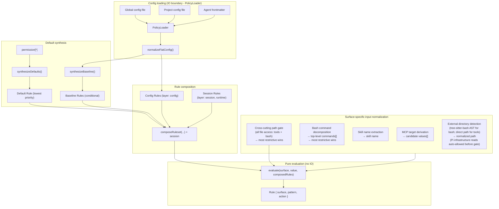
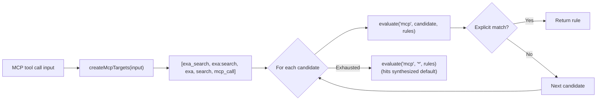
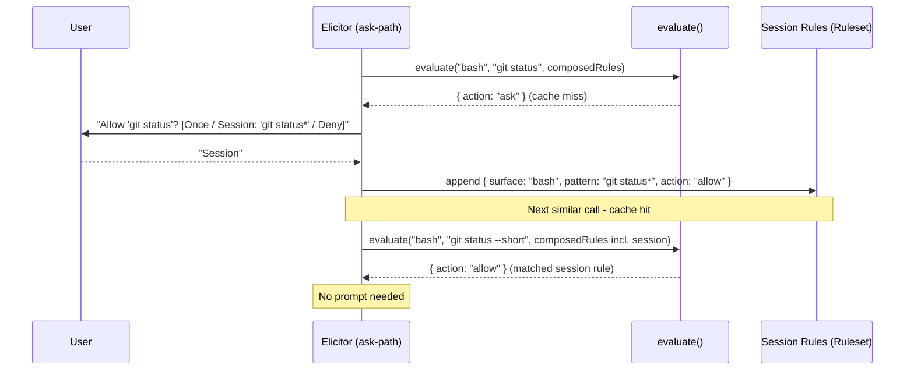
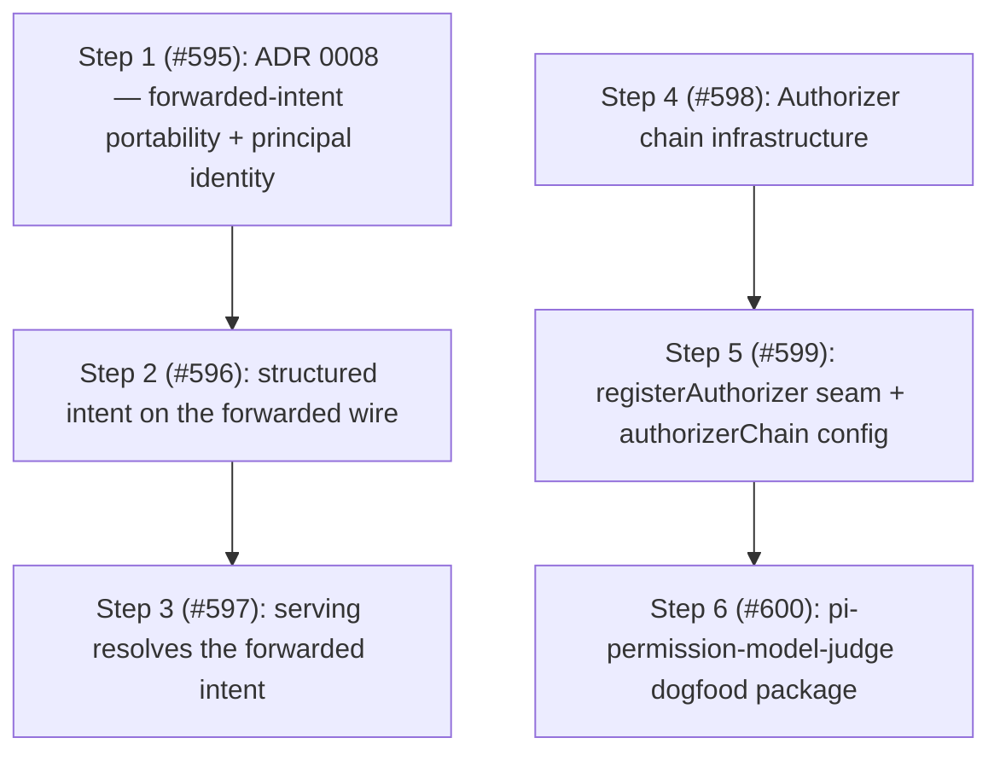

# Architecture

This document describes the internal design of the permission system, informed by [OpenCode's permission model](https://opencode.ai/docs/permissions/).

## Design principles

1. **Unified rule model** - one `Rule` type, one evaluation function, all surfaces.
2. **Pure evaluation** - permission decisions are pure functions of (surface, pattern, rules).
   IO stays at the edges.
3. **Session approvals are just more rules** - no separate matching engine, no separate pre-check.
4. **MCP stays special** - multi-name target derivation is pre-processing, not a special evaluation path.
5. **Defaults are rules** - the universal default (`permission["*"]`) is synthesized as a low-priority rule in the array.
   No side-channel fallbacks.
6. **Flat config format** - the flat `permission: { ... }` object where each key is a surface.
   The config IS the ruleset in human-friendly form.
7. **Preserve the two-phase model** - tool filtering (before_agent_start) and invocation gating (tool_call) remain separate.
8. **Ask = cache miss** - "ask" is the absence of a matching rule.
   The human is the oracle.
   Their decision is a rule.
   Persistence determines lifetime (once / session / config).
9. **Single-agent core, multi-agent by extension** - Pi is single-agent by deliberate design; the notion of multiple named agents is introduced entirely by external extensions (pi-subagents, pi-agent-router, some MasuRii packages), not by Pi itself.
   Per-agent `permission:` frontmatter is therefore an extension bridge layered on this single-agent core, not a core responsibility.
   The package learns the active agent from a generic `<active_agent>` signal (a system-prompt tag or an `active_agent` session entry), never from a hard dependency on any one multi-agent extension, so the bridge works with any tool that emits the signal.

## Core data model

### Rule

```typescript
/**
 * Provenance of a rule - which source contributed it.
 *
 * Config scopes: "global", "project", "agent", "project-agent".
 * Synthesized:   "builtin" (universal default / evaluate() fallback),
 *                "baseline" (conditional MCP metadata auto-allow).
 * Runtime:       "session" (session approvals).
 * Rewrite:       "yolo" (composition-stage ask→allow rewrite under yolo mode).
 */
type RuleOrigin =
  | "global"
  | "project"
  | "agent"
  | "project-agent"
  | "builtin"
  | "baseline"
  | "session"
  | "yolo";

interface Rule {
  /** The permission surface: "bash", "edit", "mcp", "skill", "external_directory", "path", etc. */
  surface: string;
  /** The match pattern: a command glob, tool name, file path, skill name, or "*". */
  pattern: string;
  /** The decision. */
  action: PermissionState;
  /** Custom denial reason for deny rules (optional). */
  reason?: string;
  /**
   * Origin layer - used to derive PermissionCheckResult.source after evaluation.
   * Not used by evaluate(); purely informational metadata.
   */
  layer?: "default" | "baseline" | "config" | "session";
  /** Which source contributed this rule. */
  origin: RuleOrigin;
}
```

Every config entry, default policy, session approval, and agent override normalizes into `Rule[]`.

### Ruleset

```typescript
type Ruleset = Rule[];
```

Merge precedence is array ordering.
The synthesized universal default goes first (lowest priority), then MCP baseline auto-allow rules, then config rules (global → project → agent → project-agent), and finally session rules (highest priority).
Last-match-wins: `evaluate()` scans from the end.

### Evaluate

```typescript
function evaluate(
  surface: string,
  value: string,
  rules: Ruleset,
  platform: NodeJS.Platform,
): Rule {
  for (let i = rules.length - 1; i >= 0; i--) {
    const rule = rules[i];
    // On win32 a path-surface match folds case + separators; `platform` is
    // injected from `PermissionManager` (read once at the composition root,
    // #510), never `process.platform` ambiently.
    if (ruleMatches(rule, surface, value, platform)) {
      return rule;
    }
  }
  // Unreachable when defaults are synthesized - the catch-all always matches.
  return { surface, pattern: value, action: "ask" };
}
```

The entire decision engine.
When defaults are synthesized into the array, the catch-all `{ surface: "*", pattern: "*", action: "ask" }` always matches - the fallback return is defensive only.

## Composed ruleset

All rule sources are concatenated into a single flat array.
Index position determines priority (higher index wins):

```text
  ┌─────────────────────────────────────────────────────────────────┐
  │                     Composed Ruleset (Rule[])                   │
  │                                                                 │
  │  Index 0: Synthesized universal default (layer: "default")      │
  │    { surface: "*", pattern: "*", action: permission["*"] }      │
  │                                                                 │
  │  Index 1..B: MCP baseline auto-allow (layer: "baseline")        │
  │    (only when any config rule has surface:"mcp" action:"allow") │
  │    { surface: "mcp", pattern: "mcp_status",   action: "allow" } │
  │    { surface: "mcp", pattern: "mcp_list",     action: "allow" } │
  │    { surface: "mcp", pattern: "mcp_search",   action: "allow" } │
  │    { surface: "mcp", pattern: "mcp_describe", action: "allow" } │
  │    { surface: "mcp", pattern: "mcp_connect",  action: "allow" } │
  │                                                                 │
  │  Index B+1..C: Config rules (global → project → agent,         │
  │                   layer: "config", origin: "global"|"project"   │
  │                   |"agent"|"project-agent")                     │
  │    { surface: "bash",  pattern: "*",     action: "allow",       │
  │      origin: "global" }                                         │
  │    { surface: "bash",  pattern: "git *", action: "allow",       │
  │      origin: "global" }                                         │
  │    { surface: "bash",  pattern: "rm *",  action: "deny",        │
  │      origin: "project" }                                        │
  │    { surface: "read",  pattern: "*",     action: "allow",       │
  │      origin: "global" }                                         │
  │    { surface: "mcp",   pattern: "exa:*", action: "allow",       │
  │      origin: "agent" }                                          │
  │                                                                 │
  │  Index C+1..end: Session rules (layer: "session", highest)      │
  │    { surface: "external_directory", pattern: "/other/*",        │
  │      action: "allow" }                                          │
  │                                                                 │
  │  ◄── evaluate() scans from end, first match wins ──►            │
  └─────────────────────────────────────────────────────────────────┘
```

`synthesizeDefaults()` produces a single universal catch-all from `permission["*"]`.
Per-surface catch-alls (e.g. `bash: { "*": "allow" }`) are expressed as regular config rules via `normalizeFlatConfig()` - no separate override layer is needed.

`synthesizeBaseline()` conditionally emits MCP metadata auto-allow rules.

`composeRuleset()` concatenates: defaults + baseline + config rules.
Session rules are concatenated after config rules so `evaluate()` handles them via last-match-wins - no separate per-branch pre-check.

### Default synthesis

```typescript
// Single universal catch-all from permission["*"].
function synthesizeDefaults(universalDefault: PermissionState): Ruleset {
  return [
    { surface: "*", pattern: "*", action: universalDefault, layer: "default" },
  ];
}

// MCP metadata auto-allow - only synthesized when any config rule has
// surface: "mcp" && action: "allow".
function synthesizeBaseline(configRules: Ruleset): Ruleset { ... }

// Concat in priority order: defaults, baseline, config.
function composeRuleset(defaults, baseline, config): Ruleset {
  return [...defaults, ...baseline, ...config];
}
```

## Architecture overview



The `Agent frontmatter` input (`AF`) is the per-agent override layer.
It only carries data when an external multi-agent extension is active (see design principle 9): the package resolves the active agent's name from a generic `<active_agent>` signal, then reads the `permission:` sub-document of that agent's definition file at `<cwd>/.pi/agents/<name>.md` (project) or `<agentDir>/agents/<name>.md` (global).
The package does not discover or enumerate agents — it reads one sub-document by name, on demand — and the `<cwd>/.pi/agents` location is a Pi platform convention this package encodes independently (no dependency on pi-subagents, ADR 0002).

## Config format

```jsonc
{
  "permission": {
    "*": "ask",
    "read": "allow",
    "bash": { "*": "allow", "git *": "allow", "npm *": "allow", "rm *": "deny" },
    "mcp": { "*": "ask", "exa:*": "allow" },
    "skill": { "*": "ask", "librarian": "allow" },
    "path": { "*": "allow", "*.env": "deny" },
    "external_directory": "ask"
  }
}
```

Each top-level key in `permission` is a surface name.
A string value is shorthand for `{ "*": action }` (surface-level catch-all).
An object value maps patterns to actions.
`permission["*"]` is the universal fallback.

### Normalization to Rule[]

```typescript
function normalizeFlatConfig(permission: FlatPermissionConfig): Ruleset {
  const rules: Ruleset = [];

  for (const [surface, value] of Object.entries(permission)) {
    if (typeof value === "string") {
      // Shorthand: "read": "allow" → { surface: "read", pattern: "*", action: "allow" }
      rules.push({ surface, pattern: "*", action: value as PermissionState });
    } else {
      // Object: "bash": { "*": "ask", "git *": "allow" }
      for (const [pattern, action] of Object.entries(value)) {
        rules.push({ surface, pattern, action: action as PermissionState });
      }
    }
  }

  return rules;
}
```

## MCP pre-processing

MCP is the one surface that requires pre-processing **before** evaluation.
The multi-name target derivation stays, but it feeds candidate values into `evaluate()` rather than a separate code path:



The priority ordering of candidates is preserved.
The evaluation function is unchanged - MCP just calls it multiple times with different values.
MCP target derivation helpers live in `src/access-intent/mcp-targets.ts`.
Input normalization for all surfaces lives in `src/access-intent/input-normalizer.ts`.

### Path-bearing tool normalization

Per-tool path patterns — e.g. `"read": { "*": "allow", "*.env": "deny" }` — are evaluated via the `access-path` intent the per-tool gate emits ([#502]).
When the pipeline calls `resolvePerToolCheck`, a present `input.path` triggers `normalizer.forPath(path)` and an `access-path` intent on the tool-name surface; the resolver unwraps it to `path-values` carrying the lexical ∪ canonical alias set before the manager evaluates the rule.
When `input.path` is missing or empty, the pipeline falls back to a `tool` intent, which `normalizeInput` collapses to `["*"]` (surface catch-all).
Path alias derivation (home-expansion, cwd-relative aliases) lives in `getPathPolicyValues` / `AccessPath` — not in `normalizeInput`, which no longer touches path surfaces (#504).
`getToolPermission()` is unaffected — it always evaluates with `"*"` to determine whether to inject the tool at agent start.

The cross-cutting `path` and `external_directory` gates extract paths for **extension and MCP tools too** (#352): `describePathGate` and `describeExternalDirectoryGate` call `getToolInputPath`, which reads `input.path` for built-ins, `input.arguments.path` for MCP, and a registered `ToolAccessExtractor` (or the default `input.path` convention) for any other tool.
The extractor registry (`src/tool-access-extractor-registry.ts`) is created once in `index.ts` and shared: its lookup side is threaded into `ToolCallGatePipeline`, and its registrar side is exposed cross-extension via `PermissionsService.registerToolAccessExtractor`.
Per-tool path maps for extension tools (a custom extractor key per tool) are a deferred follow-up.

## Session approvals: the cache-miss model

Session rules are stored as `Ruleset` and are generalized to all surfaces.

`evaluate()` is a **lookup** against cached decisions.
When no rule matches (or the matching rule says "ask"), the system has a cache miss - it needs the human oracle to produce a decision.

The human's response is simultaneously:

1. **The answer** for this request (allow or deny).
2. **A rule** that can be cached for future lookups.

The dialog determines **persistence** - where the rule lives:

```text
  evaluate(surface, value, composedRules)
       │
       ├── match.action = "allow" → proceed (cache hit)
       ├── match.action = "deny"  → block (cache hit)
       │
       └── match.action = "ask"   → cache miss, query oracle
                │
                ▼
           Dialog: "[surface] wants to [value]"
                │
                ├── "Yes"              → allow this request (no persistence)
                ├── "Yes, for session" → allow + store in session layer
                │                        (future lookups hit without asking)
                ├── "No"               → deny this request (no persistence)
                └── (future: "Always") → allow + store in config layer (disk)
```

### Pattern suggestions

When prompting, each surface suggests a **pattern** for the "for session" option.
The pattern determines what class of future requests auto-approve:

| Surface                | Input value                 | Suggested session pattern   | Mechanism                |
| ---------------------- | --------------------------- | --------------------------- | ------------------------ |
| bash                   | `git checkout main`         | `git checkout *`            | Arity table              |
| bash                   | `npm run dev`               | `npm run dev`               | Arity table              |
| tool (read/write/etc.) | tool surface itself         | `*` (all uses of that tool) | Tool-level               |
| mcp                    | `exa:search`                | `exa:*`                     | Server-level wildcard    |
| skill                  | `librarian`                 | `librarian`                 | Exact name               |
| external_directory     | `/other/project/src/foo.ts` | `/other/project/*`          | Directory prefix as glob |

The suggestion is shown in the dialog text so the user sees what they're approving:

```text
  ● Allow once
  ● Allow "git checkout *" for this session
  ● Deny
```

### Implementation



## Two-phase checking

### Phase 1: Tool filtering (`before_agent_start`)

```typescript
function shouldExposeTool(toolName: string, rules: Ruleset): boolean {
  const rule = evaluate(toolName, "*", rules);
  return rule.action !== "deny";
}
```

Uses `evaluate()` with pattern `"*"` - "is this tool denied at the surface level, regardless of specific input?"

### Phase 2: Invocation gating (`tool_call`)

```typescript
// Surface-specific input normalization (what to query)
const { surface, value } = normalizeInput(toolName, input);

// Single evaluation against the composed ruleset (how to decide)
const rule = evaluate(surface, value, composedRules);

if (rule.action === "allow") return proceed;
if (rule.action === "deny") return block;
// rule.action === "ask" - elicit from oracle
const decision = await elicitRule(surface, value, suggestPattern(surface, value));
if (decision.persistence === "session") {
  sessionRules.approve(surface, decision.pattern);
}
return decision.action === "allow" ? proceed : block;
```

Same `evaluate()`, same ruleset.
The only surface-specific logic is input normalization (what `surface` and `value` to look up) and pattern suggestion (what glob to offer for "session" approval).

`checkPermission()` uses a single evaluate path: `normalizeInput()` → `evaluateFirst()` → `deriveSource()` → single result object.

## Subagent detection and permission forwarding

When `ask`-state permissions arise in a headless subagent child process, the extension forwards the dialog to the parent session rather than silently denying.
This requires two detections:

1. **Is the current process a subagent?**
   - `isSubagentExecutionContext()` in `src/authority/subagent-context.ts`.
2. **What is the parent session ID?**
   - `resolvePermissionForwardingTargetSessionId()` in `src/authority/permission-forwarding.ts`.

### Known extension env var inventory

| Extension                                                                           | Child-process env vars                                                                    | Parent-session env var              |
| ----------------------------------------------------------------------------------- | ----------------------------------------------------------------------------------------- | ----------------------------------- |
| pi-agent-router (original)                                                          | `PI_IS_SUBAGENT`, `PI_SUBAGENT_SESSION_ID`, `PI_AGENT_ROUTER_SUBAGENT`                    | `PI_AGENT_ROUTER_PARENT_SESSION_ID` |
| [nicobailon/pi-subagents](https://github.com/nicobailon/pi-subagents)               | `PI_SUBAGENT_CHILD`, `PI_SUBAGENT_RUN_ID`, `PI_SUBAGENT_CHILD_AGENT`, `PI_SUBAGENT_DEPTH` | none set (see #98)                  |
| [tintinweb/pi-subagents](https://github.com/tintinweb/pi-subagents)                 | none - runs fully in-process via `createAgentSession()`                                   | n/a - deferred to #29               |
| [HazAT/pi-interactive-subagents](https://github.com/HazAT/pi-interactive-subagents) | `PI_SUBAGENT_NAME`, `PI_SUBAGENT_ID`, `PI_SUBAGENT_SESSION`, `PI_SUBAGENT_ACTIVITY_FILE`  | none set (see #98)                  |

### Detection (`isSubagentExecutionContext`)

`isSubagentExecutionContext()` checks three sources in priority order:

1. **Explicit registry** - `@gotgenes/pi-subagents` emits `subagents:child:session-created` before `bindExtensions()`; the permission system's subscriber writes the entry into `SubagentSessionRegistry` synchronously.
   The registry (keyed by **child session id**) is checked first.
   Each concurrent sibling child of the same parent receives a unique session id from `sessionManager.newSession()`, so siblings occupy distinct keys - one sibling's `disposed` event cannot evict another's entry (fixes #298).
   The registry is a process-global singleton (via `getSubagentSessionRegistry()`, backed by `globalThis` + `Symbol.for()`) because each session's `ResourceLoader` creates its own `pi.events` bus: the parent's instance registers the child over the parent bus, while the child's separate jiti instance reads the same global store to detect itself and resolve its forwarding target.
2. **Env vars** (`SUBAGENT_ENV_HINT_KEYS`) - returns `true` when any key is set to a non-empty, non-whitespace value.
   Used by process-based subagent extensions.
3. **Filesystem path** - session-directory path-based fallback (child session dir is nested under `subagentSessionsDir`).

### Parent-session resolution (`resolvePermissionForwardingTargetSessionId`)

`resolvePermissionForwardingTargetSessionId()` checks two sources in priority order:

1. **Explicit registry** - if the caller provides a `sessionId` and `registry`, the registry entry's `parentSessionId` is returned when present.
   Used by in-process subagent extensions.
2. **Env vars** (`SUBAGENT_PARENT_SESSION_ENV_CANDIDATES`) - iterates candidates and returns the first non-empty, non-`"unknown"` value.
   Used by process-based subagent extensions.

Neither nicobailon nor HazAT sets a parent-session env var today, so forwarding still fails for those extensions with an explicit log message pointing to #98.
Adding a new env var candidate when an extension adopts the convention is a one-line change to the array.

### In-process case (resolved)

In-process subagent extensions (e.g. `@gotgenes/pi-subagents`) call `createAgentSession()` directly - no child process is spawned and no env vars are ever set.
`@gotgenes/pi-subagents` publishes `subagents:child:session-created` (before `bindExtensions()`) and `subagents:child:disposed` (in the run's `finally`); `src/authority/subagent-lifecycle-events.ts` subscribes and writes/removes the entry in `SubagentSessionRegistry` synchronously.
The registry is process-global (see `getSubagentSessionRegistry()` in `src/authority/subagent-registry.ts`) so the child's separate jiti instance reads the same store as the parent.
See `src/authority/subagent-registry.ts` and [Subagent Integration](../subagent-integration.md) for details.

### External convention guide

A [permission frontmatter convention guide](../guides/permission-frontmatter-for-subagent-extensions.md) documents how upstream subagent extensions can adopt the `permission:` frontmatter key as a shared convention.
This is a documentation-only proposal - no code dependency is required.
The guide covers the two-layer model, flat format reference, composition examples, and the optional event bus runtime integration.

## Cross-extension service accessor

The primary cross-extension API is a `Symbol.for()`-backed service object on `globalThis`.

Pi's extension loader creates a fresh jiti instance per extension with `moduleCache: false`, isolating module-scoped state.
`Symbol.for()` and `globalThis` are process-global by spec, so they survive this isolation.

The extension publishes a `PermissionsService` object via `publishPermissionsService()` at `session_start`, gated so an in-process subagent child does not clobber the parent's service (#302).
Other extensions retrieve it with `getPermissionsService()` from `import("@gotgenes/pi-permission-system")`.
The `package.json` `exports` field's `default` condition points to `src/service.ts`, which contains the interface, the accessor functions, and the `Symbol.for()` key - no extension machinery.
The `types` condition instead resolves to a bundled `dist/public.d.ts` (built by `rollup-plugin-dts` from `rollup.dts.config.mjs`, published via `prepack`) so a downstream consumer's `tsc` never follows the raw `#src/*` module graph - only the `default` condition (the jiti runtime) reads `src/` directly (#592).

The `PermissionsService` interface exposes three methods:

- `checkPermission(surface, value?, agentName?)` - full policy query.
- `getToolPermission(toolName, agentName?)` - tool-level permission state (`allow`/`deny`/`ask`) for pre-filtering.
- `registerToolInputFormatter(toolName, formatter)` - register a custom ask-prompt preview for a tool name; returns a disposer (#283).

`permissions:decision` and `permissions:ui_prompt` broadcasts remain on the event bus - fire-and-forget observation is the right abstraction for those channels ([#531] removed the event-bus RPC channel; the service accessor is now the sole cross-extension policy/prompt surface).

## The authority model

This section records the organizing concept the package is built around — the spine the elicitation, forwarding, and yolo machinery collapse into — plus the still-open directions that extend it.
It is current state, not a target: the `Authorizer` interface, its three implementations, once-per-activation selection, `canConfirm()`'s dissolution, serving-as-resolution, human-selectable grant-scope, and the `authority/` directory migration all shipped in Phase 9 (see [history/phase-9-authorizer-spine.md](history/phase-9-authorizer-spine.md) for why the spine is the correct model of the `@gotgenes/pi-subagents` integration — the anonymous cross-session-authority recursion behind the [#296]/[#298]/[#302] bug history — and not merely an internal tidy).
Of the ["beyond the target"](#beyond-the-target-a-non-deterministic-access-intent-classifier) extension points below, the model-triage `Authorizer` chain is now designed ([ADR 0007](../decisions/0007-model-judge-authorizer-chain-adr.md), pending [#472]) and its named-link registration subsumes the pluggable escalation seam; a non-deterministic access-intent classifier remains aspirational.

### The spine

Every action resolves against an **authority** — an entity empowered to permit or forbid it.
The only questions are *which* authority and how we reach it.

This sharpens principle 8.
That principle calls the human "the oracle," borrowing the computer-science term for a black box consulted for an answer the system cannot compute.
But a permission decision is not epistemic (who *knows* the answer); it is deontic (who has the *right* to decide).
If a bystander happened to know what the user wanted, their saying "allow" would authorize nothing.
What makes a decision binding is authority, not knowledge — so the organizing concept is authority, and the entity that holds it is an **`Authorizer`**.
The human is merely the `Authorizer` at the interactive root; another agent can hold the role equally well.

### Authority lives in three places

1. **Recorded authority** — the ruleset.
   Config (durable, on disk), session rules (this session), and synthesized defaults/baseline are all prior rulings.
   `evaluate()` *is* "consult recorded authority": an `allow` or `deny` means recorded authority is sufficient, and the decision is final.
2. **Live authority** — reached only on `ask`, when recorded authority is silent.
   An entity empowered to rule *now*, reached through one of three channels (below).
3. **Absent authority** — nothing recorded, nothing reachable.
   Least privilege applies: no authority means the action is unauthorized, so it is denied.

The three are one thing at different lifetimes.
A live ruling, once persisted, *becomes* recorded authority — principle 8's "their decision is a rule."
The "for this session" dialog option writes a session rule; a future "always" writes config.

### The `Authorizer` role

On `ask`, the gate escalates to **one `Authorizer`, selected once per session from context**, and is told the decision.

1. **`LocalUserAuthorizer`** — the session has UI; prompt the human here.
2. **`ParentAuthorizer`** — the session is a subagent; escalate up the tree to the parent's authority.
3. **`DenyingAuthorizer`** — no authority is reachable; deny (least privilege).

There is no "can anyone answer" pre-check.
`canConfirm()` — today a boolean smeared across the gateway, prompter, and forwarder — dissolves: every `Authorizer` answers, the `DenyingAuthorizer` by denying.
The three context predicates (`hasUI`, `isSubagent`, yolo) are evaluated once, at selection, instead of repeatedly down the prompt path.

```text
evaluate(action, recorded authority)
  ├─ allow / deny ------------------> decided (recorded authority sufficient)
  └─ ask (recorded authority silent)
        └─ escalate to the session's Authorizer
              ├─ LocalUserAuthorizer -> prompt the human here
              ├─ ParentAuthorizer    -> forward up the tree, await the parent's ruling
              └─ DenyingAuthorizer    -> deny (no authority reachable)
                    |
              (a persisted ruling becomes recorded authority)
```

### The recursion

Authority is delegated **down** the session tree: the human drives the root, which spawns subagents that hold no inherent authority to approve a novel action.
So an `ask` a subagent cannot answer **escalates up** to where authority resides.
Permission-system instances form a tree mirroring the session tree, and `ParentAuthorizer` is the edge that routes a child's escalation toward the human at the root.
This is the same recursion pi-subagents describes (a subagent is a child Pi), viewed from the permission system's side: the package is itself one of the hooks on that child, and it recurses by forwarding.

### yolo is recorded authority

yolo is not a channel and not a live concern — it is a standing authorization, and it belongs in the ruleset, not in the prompt path.
It is a composition-stage rewrite: when enabled, every `ask` action in the composed ruleset is rewritten to `allow`, tagged `origin: "yolo"` so the review log still distinguishes a yolo grant from a policy allow.

```typescript
const effective = yolo
  ? composed.map((r) => (r.action === "ask" ? { ...r, action: "allow", origin: "yolo" } : r))
  : composed;
```

This is faithful to current behavior exactly: explicit `deny` rules are not `ask`, so they pass through untouched — yolo suppresses prompts but **preserves hard denies**.
It honors principle 5 (defaults are rules; no side-channel fallbacks): `evaluate()` runs pure over the rewritten ruleset, and the decision path loses all yolo knowledge (`shouldAutoApprovePermissionState` and `canResolveAskPermissionRequest`'s yolo arm dissolve).
A future "disable everything" mode — overriding denies too — would be a *different*, deliberately named operation: appending a final `{ surface: "*", pattern: "*", action: "allow" }` rule (last-match-wins).
It is not built, and it would be requested by name, never conflated with yolo.

### Discriminating delegation: a model `Authorizer`

Nothing constrains an `Authorizer` to be deterministic.
`LocalUserAuthorizer` is already a non-deterministic oracle — the human — and the determinism principle governs *recorded* authority (`evaluate()`), never the live-authority layer.
A model (e.g. Claude Haiku) can hold an `Authorizer` role on the same terms: it is live authority, so it never touches `evaluate()` or the deterministic core.

The design is settled in [ADR 0007](../decisions/0007-model-judge-authorizer-chain-adr.md); the essentials follow.

**The live-authority layer is a Chain of Responsibility.**
Each link returns `allow | deny | defer`; on `defer` the next link decides.
The chain ends at a **terminal that cannot defer** — today the human (`LocalUserAuthorizer`), the headless `DenyingAuthorizer`, or `ParentAuthorizer` (terminal for its node, forwarding up to the parent node's chain — the [recursion](#the-recursion) above).
The invariant is type-level: a terminal returns only `allow | deny`, so a deferring link cannot occupy the terminal slot.
`selectAuthorizer` becomes the terminal-selection step of `composeAuthorizerChain` — registered non-terminal links, then the context-selected terminal.

```text
ask -> [ model-judge link ] --defer--> … --defer--> [ terminal: human | Parent | Denying ]
              ├─ deny (with teaching reason)   -> denied
              ├─ allow (slice 2, if not excluded) -> permitted
              └─ defer                          -> next link
```

**The model judge is a non-terminal link**, not a decorator or a fourth channel.
It reviews an `ask`, decides the ones it is confident about, and defers the rest to its successor — a middle rung between prompt-everything and allow-everything.
Denies are decided by recorded authority and structurally never reach an `Authorizer`, so a model link cannot grant a hard deny; the safeguard for a sensitive resource stays an explicit `deny` rule, which survives the model just as it survives the yolo rewrite.

The verdict range is `allow | deny | defer` — a superset of the earlier allow-or-escalate framing — because the first use case is **deny-first**.
A light model reviews `external_directory` asks, denies an errant "typo" path with a teaching `reason` (wrong path; correct location) so the invoking model self-corrects, and defers everything else.
A second use case adjudicates **opaque bash**: the model decomposes a `bash -c "…"` / `eval` command and queries the deterministic engine per sub-command through an injected, narrow `PermissionQuery` (never a reach-through to `PermissionsService`), allowing only what the engine already grants for the pieces it identifies.
The two are one link on a **capability gradient**: the deny/defer reviewer is strictly more restrictive and ships first; the allow-capable adjudicator loosens privilege and is gated behind the full envelope (hard exclusions, audit `origin: "authorizer:model"`, non-persistence, off by default), because its safety property holds only if the model's decomposition is faithful.

Registration mirrors `registerToolAccessExtractor`: a downstream extension offers a **named** capability (`registerAuthorizer("model-judge", …)`) on `permissions:ready`, and this package makes no LLM call itself.
Three invariants govern the seam: config order (not registration order) fixes the security-relevant chain order; a missing configured link is skipped fail-safe (more prompting, never less); and **registration alone grants no authority** — a link decides nothing until the operator names it in the `authorizerChain` config (opt-in).
Bounded delegation is operator config this package enforces at a checkpoint that downgrades an excluded-surface `allow` to `defer`, with `external_directory` and secret-shaped `path` always excluded; the model's provider/prompt/threshold live in the downstream extension's own config.

This is the principled successor to the per-command argument-position work deferred from [#509].
Rule-driven promotion ([#509]) produces the `ask` for a bare filename that matches a `path` rule and deliberately accepts a fail-safe false positive (`git grep id_rsa` prompts); that false positive lives on the *ask-producing* side of `evaluate()`, and the model link dismisses it on the *ask-consuming* side without hard-coding per-command file-argument tables.
The two compose cleanly because a promoted token emits the same structured descriptor a prefixed path does, so a link needs no promotion-specific knowledge.

**Dogfooded:** a first-party monorepo package (`packages/pi-permission-model-judge`) implements the deny-first typo-path reviewer against the real seam, so `registerAuthorizer` is born consumed (the [#267] vacant-surface guard).

### Resolved direction

These were the open decisions; they are now settled and shipped (full rationale in [history/phase-9-authorizer-spine.md](history/phase-9-authorizer-spine.md)).

1. **Serving is resolution.**
   A serving node runs `evaluate()` against its recorded authority then escalates to its own `Authorizer` on `ask`, carrying the forwarded ask's provenance as data so the `permissions:ui_prompt` broadcast stays non-degraded.
2. **Multi-level escalation: admitted, not shipped.**
   A middle node's chain terminates in a `ParentAuthorizer`, so re-escalation needs no special-casing; the tree is depth-2 today (pi-subagents' recursion guard), and a one-hop canary flags any future break.
3. **Full delegation of authority down the tree.**
   A subagent inherits its ancestors' `allow`/`deny` rules and yolo; because yolo is deny-preserving, the safeguard for a cheaper delegate is an explicit `deny` in its per-agent frontmatter, not an `ask`.
4. **Grant scope is human-selectable.**
   Approving a forwarded request "for this session" offers root / parent / requesting-subagent scope (requesting subagent pre-selected); "parent" and "root" coincide until trees deepen.

### Remaining design work

**Access-intent extraction** is the one genuinely open piece, and the foundation for the path surface of the decisions above.
The package's center of mass is not the decision engine (tiny, pure) but turning `(toolName, input)` into "what is being accessed" — bash decomposition, MCP target derivation, path extraction, external-directory detection.
This is a distinct domain (access intent) that gates should *emit* and a single `resolve(intent)` should answer, so adding a gate cannot widen the resolver surface.
The [#393] false-green (a stubbed-but-unrouted resolver method silently passing `allow`) was the probe pointing at it: the resolver surface was `resolve` + `resolvePathPolicy`, widening per gate, until Phase 6 Step 6 ([#478]) collapsed it to one `resolve(intent)`.
[#418] is a second probe, from the access-path side: both external-directory gates matched config patterns against the symlink-resolved path because a single `string` carries a path that is simultaneously a containment value (canonical, for the outside-CWD boundary) and a match value (lexical, as the user typed it), with no type distinction — so the canonical form leaked into matching and defeated a configured `/tmp/*` allow.
The same conflation lived in `BashProgram.externalPaths(): string[]`, which returned only the canonical form and so lost the typed value the matcher needed.
The fix's `getExternalDirectoryPolicyValues` helper (the union of lexical aliases and the canonical path) was the embryo of the access-path: `AccessPath` ([#476]) now holds both forms behind distinct `matchValues()` and boundary accessors, making the misuse a compile error; `BashProgram.externalPaths()` now returns `AccessPath[]` and one external-directory policy check can replace the two parallel gates that independently acquired this bug.
The intent must carry **principal identity** (which agent is requesting) so a forwarded request is evaluable on the serving node, and it must define **path portability across cwds** — a subagent in a `pi-subagents-worktrees` worktree resolves paths against a different root than the parent, so cross-session path evaluation is only well-defined once the intent fixes what a path *means*.
Sequencing: extract access-intent first — it unblocks correct cross-session path evaluation and kills the false-green class; non-path serving, yolo inheritance, and the escalation unification can land alongside.
The tractable first slice is the access-path value object seeded by [#418]: it removes the path-representation conflation and the duplicate external-directory gate without waiting on principal identity or cross-session portability.

### Beyond the target: a non-deterministic access-intent classifier

This is a **more distant** direction than the target above — noted as a candidate extension point, not planned work.

Access-intent extraction is deterministic by design: `(toolName, input)` becomes "what is being accessed" through bash decomposition, MCP target derivation, and path rules.
A second, independent place non-determinism could one day enter is a model that *classifies* access intent **before** `evaluate()` — deciding, for instance, that `id_rsa` in `git grep id_rsa` is a search pattern rather than a file, so no path candidate is emitted at all.

The classifier differs from the [`ModelTriageAuthorizer`](#discriminating-delegation-a-model-authorizer) in *where the model sits*.
The classifier feeds **recorded** authority — it shapes the intent `evaluate()` rules on — whereas the Authorizer holds **live** authority and answers the `ask`.
A wrong classifier call is a misread of what is being accessed; a wrong Authorizer call is a mis-granted decision.
Because the classifier changes the *input* to the deterministic core, it weakens the "same `(toolName, input)` yields the same ruling" property more subtly than the Authorizer does — the model output becomes part of the intent — so it warrants its own decision record and is deliberately out of scope for the current target.
The access-intent domain the gates emit into is the natural seam for such a pluggable classifier: deterministic today, model-assisted only if and when that trade is made by name.

### Beyond the target: a pluggable escalation seam

The **registration seam** this section anticipated is now designed: [ADR 0007](../decisions/0007-model-judge-authorizer-chain-adr.md) settles the `Authorizer` chain and its named-link registration (`registerAuthorizer`), with the model judge as its first consumer.
What remains a **more distant** direction — a candidate extension point, not planned work — is applying that same seam to *replace the terminal* (a delegation framework other than pi-subagents, a chat-approval bot, or a remote review surface *as* the authority) and refactoring the built-in subagent integration to register through it.

The [#261]/[#267] inversion made pi-subagents pure — it publishes its child lifecycle and knows nothing about consumers ([ADR-0002]) — but the purity is one-sided: this package is the integration owner.
It knows pi-subagents' event channel names (`subagent-lifecycle-events.ts`), hardcodes an env-hint inventory of known third-party subagent extensions (`SUBAGENT_ENV_HINT_KEYS`), and bakes in a session-directory heuristic.
Supporting a new delegation framework — or something that is not a subagent extension at all, such as a chat-approval bot or a remote review surface — means editing this package.

The subagent machinery decomposes into three roles a seam would name and separate:

- **Detection** — is this session a delegated context?
  This is an Authorizer-selection predicate; [#529]'s `SubagentDetection` gives it one owner.
- **Target resolution** — where does authority live for this session; which node serves the escalation (`resolvePermissionForwardingTargetSessionId` today).
- **Transport** — how an `ask` travels to that authority and the ruling returns (the file-based request/response polling today; [#530]'s escalation-up role, `ParentAuthorizer` since [#555]).

A registered provider is exactly a selection predicate plus a `ParentAuthorizer`-shaped transport: "when my predicate matches this session and recorded authority is silent, escalate through me."
The `Authorizer` spine is therefore the seam — this direction is the spine's registration story, not a mechanism beside it.

Two shapes, the second generalizing the first:

1. **A bridge extension** — a third package subscribes to pi-subagents' lifecycle and registers with this package's public seam, leaving both cores pure.
   A dedicated glue extension knowing both ends is the sanctioned complement of the rule against outbound bridges *from a core*.
2. **A dogfooded provider seam** — this package defines the registration API and implements its own built-in pi-subagents integration through it, the way `registerToolAccessExtractor` / `registerToolInputFormatter` already let extensions plug the gates; third parties register on equal terms and the zero-config default survives.

A history guard: this re-introduces an inbound registration surface of the kind [#267] retired.
It differs in kind — consumer-agnostic, documented for third parties, and consumed by the built-in provider itself, so it cannot go vacant the way the two-method `registerSubagentSession` RPC did.

Any design must honor the standing constraints: registration lands synchronously before `bindExtensions()`; cross-session visibility rides `globalThis` + `Symbol.for()` (the [#296] bus-split lesson); a provider is live authority only and never touches `evaluate()`; and a session no provider claims selects `DenyingAuthorizer` — least privilege, unchanged.
It sequences after the Phase 9 spine and warrants its own decision record.

### Naming

The concept and the code role take two grammatical forms of one root, each for what it correctly denotes:

- **`authority`** (mass noun) — the right to decide; used for the concept ("recorded authority," "where authority lives").
- **`Authorizer`** (count noun) — the entity that holds it; used for the interface and its implementations.

`Authorizer` is domain-idiomatic: AWS Lambda "authorizers" and OAuth's authorization server return allow/deny, so the term already denotes an entity that can refuse.

## Module structure

```text
src/
├── rule.ts                   Rule type, Ruleset type, evaluate() (takes an injected `PathFlavor` for win32 path-surface case-folding, supplied by `PermissionManager`, #510, #562); exports `pathMatchOptions(surface, flavor)` — returns the flavor's win32 case/separator match options for a path surface, reused by `PermissionManager.getPromotablePathTokenMatcher` so bare-token promotion matching agrees with `evaluate()` (#509)
├── normalize.ts              Config → Ruleset normalization (flat format)
├── synthesize.ts             Universal default + MCP baseline → Ruleset
├── wildcard-matcher.ts       Compiled glob matching
├── pattern-suggest.ts        Per-surface approval pattern suggestions
├── bash-arity.ts             Command arity table for bash pattern suggestions
├── expand-home.ts            ~/$HOME expansion for patterns and path values
├── session-approval.ts        SessionApproval value object - owns the single/multi-pattern union; exposes representativePattern and toGateApproval()
├── session-rules.ts          Session approval store (Ruleset wrapper); `implements SessionApprovalRecorder` — `recordSessionApproval(approval)` fan-out delegates to per-pattern `approve()`; injected directly into `GateRunner` as the recorder role (#341)
├── policy-loader.ts          PolicyLoader interface + FilePolicyLoader (file I/O, mtime caching)
├── scope-merge.ts            Cross-scope permission merge + origin-map bookkeeping
├── permission-manager.ts     Scope loading + rule composition + `check(intent)` (single resolution entry point, #478); delegates I/O to PolicyLoader; `getPromotablePathTokenMatcher(agentName?)` builds a `PathRuleTokenMatcher` predicate from the composed config's specific (non-`*`) `path`-surface deny/ask rules, folding Windows case/separators via `rule.ts`'s `pathMatchOptions` — feeds bash bare-filename promotion (#509)
├── permission-gate.ts        Pure deny/ask/allow gate (injected IO)
├── permission-resolver.ts    `ScopedPermissionResolver` interface - the single `{ resolve(intent) }` role the gate factories / runner / pipeline depend on (#478); `PermissionResolver` concrete class - holds `ScopedPermissionManager` + `SessionRules`, owns `resolve(intent)` (unwraps an `access-path` `AccessIntent` via `matchValues()` before calling `manager.check`) / raw `checkPermission` (implements `SkillPermissionChecker`, no session rules) / `getToolPermission` / `getConfigIssues`; extracted from `PermissionSession` (#340); the query methods (`getToolPermission` / `getConfigIssues`) are now consumed by `AgentPrepHandler` / `SessionLifecycleHandler` (#341)
├── decision-reporter.ts      `DecisionReporter` interface + `GateDecisionReporter` class - owns `SessionLogger` and event bus; writes review-log entries and emits decision events (#322)
├── decision-audit.ts         `DecisionRecorder` / `DecisionSummaryWriter` / `AuditLogger` interfaces + `DecisionAudit` class - per-session decision counters (`recordDecision` / `recordError`); `writeSummary` emits a `permission.session_summary` debug line on shutdown and warns on a `toolCalls != allowed + blocked + errors` invariant violation (#452)
├── session-approval-recorder.ts `SessionApprovalRecorder` interface - records a granted session-scoped approval into the session ruleset; implemented by `SessionRules` (#323, #341)
│
├── permission-session.ts     `PermissionSession` class - state/lifecycle owner: owns context lifecycle, session-rule lifecycle (`reset`/`shutdown`/`reload`), skill entries, agent-name resolution, the config gateway, the Tell-Don't-Ask gate inputs, and `notify(message)` (Tell-Don't-Ask UI warn over the owned context, no-op before activation — dissolves the `index.ts` forward-reference cycle, #363); `implements ToolCallGateInputs` (the pipeline's input contract); the resolve role moved to `PermissionResolver` (#340), the recorder role to `SessionRules`, and the three fig-leaf handler role interfaces (`GateHandlerSession` / `AgentPrepSession` / `SessionLifecycleSession`) were retired — handlers depend on the concrete class + `PermissionResolver` (#341)
├── path-normalizer.ts        `PathNormalizer` class - the path-interpretation collaborator constructed once at the session edge with the injected `PathFlavor` (exposed as `readonly flavor`) and session `cwd` baked in (#510, #562); hands raw tokens, returns prepared values: `forPath`/`forLiteral` (build `AccessPath`s), `isAbsolute`/`resolveBase`/`joinBase` (flavor-aware `cd`-fold routing the `BashPathResolver` asks), `isWithinDirectory`/`isOutsideWorkingDirectory` (containment), `comparableValue` (lexical comparison value for skill-prompt matching, [#511]), `isInfrastructureRead` (Pi infra-read containment over an `AccessPath`, [#511]), `forBashToken`/`interpretBashCdTarget`/`isBoundaryOutsideWorkingDirectory` (Git Bash/MSYS bash-token interpretation — safe devices preserved, `/c/…` drive mounts translated, other POSIX absolutes literal-only; the shape comes from `flavor.bashTokenShape`, so no `!== "win32"` guard remains, #533, #562); holds no platform discriminator — every platform question delegates to `flavor` (and the flavor-parameterized `path/path-containment` / `path-normalization` / `path/pi-infrastructure-read` / `AccessPath` primitives), so no consumer reads `process.platform` or threads `cwd`; `usesWindowsSeparators` and the `win32`/`posix` `impl` selection were dissolved onto `PathFlavor` (#562); a facade over those primitives — [#505] dissolved `path-utils.ts` into those cohesive modules, and `isOutsideWorkingDirectory` now canonicalizes its operands here before the pure containment check
├── access-intent/           Domain directory seeded by Phase 6 Step 1 (#473); bash sub-domain completed by Phase 6 Step 3 (#475); `AccessPath` value object added by Phase 6 Step 4 (#476); `AccessIntent` union added by Phase 6 Step 6 (#478); path representation (`path-normalization.ts`) relocated here by Phase 7 Step 4 (#505); the four access-intent stragglers (`input-normalizer.ts`, `mcp-targets.ts`, `tool-input-path.ts`, `path-surfaces.ts`) folded in from the flat root by Phase 11 Step 1 (#579)
│   ├── path-normalization.ts `AccessPath`'s representation backing (relocated from `path-utils.ts`, [#505]): `normalizePathForComparison` (lexical absolute, via `flavor.comparable`), `canonicalNormalizePathForComparison` (symlink-resolved + win32-lowercased via `flavor.fold`, [#382]), `normalizePathPolicyLiteral` (literal cleanup), `getPathPolicyValues` (lexical ∪ relative match set) + `PathPolicyValueOptions`; pure derivation, injected `PathFlavor`, uses `flavor.isWithin` for the cwd-relative alias (#562)
│   ├── access-intent.ts     `AccessIntent` discriminated union each gate emits: `tool` (raw input the manager normalizes) and `access-path` (an `AccessPath` for every path gate — `path`, `external_directory`, and the per-tool path-bearing surfaces `read`/`write`/`edit`/`grep`/`find`/`ls`, #486, #502); `ResolvedAccessIntent` (`tool | path-values`) is what the manager consumes after the resolver unwraps `access-path` via `matchValues()`, keeping the manager string-based — `path-values` is resolver-internal, not gate-emitted, since #486 (#478, #486)
│   ├── access-path.ts       `AccessPath` value object: `matchValues(): string[]` (lexical alias union ∪ canonical, the [#418] match set), `boundaryValue(): string` (symlink-resolved + win32-lowercased, [#382]), `value(): string` (lexical absolute display form), `resolvedAlias(): string | undefined` (the canonical form only when distinct from the lexical form, for disclosing a symlink target in a prompt/denial message, #507); the surface-neutral `forPath(pathValue, { cwd, resolveBase?, flavor })` factory composes `getPathPolicyValues` + `normalizePathForComparison` + `canonicalNormalizePathForComparison` (all from `path-normalization.ts`, [#505]) (resolveBase defaults to cwd; `PathFlavor` injected, not read ambiently, #510, #562; serves every path surface, #486), and `forLiteral(literal, matchAliases?)` builds a literal-only path with no canonical for the unknown-base bash case ([#393]); `forDevice(devicePath)` preserves an MSYS device path verbatim across all three representations, and `forLiteral`'s optional `matchAliases` carries a win32 backslash match alias for a Git Bash POSIX absolute so a `/tmp/*` rule matches under separator folding (#533); type-distinct accessors make the lexical/canonical conflation a compile error (#476)
│   ├── tool-kind.ts        `ToolKind` string-union classification + `classifyToolKind(toolName)` — the single dispatch point deciding what an invocation accesses (bash command / MCP target / skill / path-bearing tool / extension) once at the normalize boundary; imports only `PATH_BEARING_TOOLS` (AccessPath-free, so `permission-manager.ts` may consume it without breaching the ADR-0002 string boundary); the extraction consumers (`input-normalizer`, `tool-input-path`, the tool-call gate pipeline, `permission-manager`'s `deriveSource`) dispatch on it instead of re-deriving `toolName === "bash"`/`"mcp"` (Phase 10 Step 1, #568); also owns `isMcpCheck({ toolName, source })` — the shared MCP-ness predicate (keeps the `source === "mcp"` disjunct) the presentation consumers (`denial-messages`, `permission-prompts`, `tool-preview-formatter`, `deriveDecisionValue`) dispatch on alongside `classifyToolKind`, replacing their re-derived `(source === "mcp" || toolName === "mcp")` checks (Phase 10 Step 2, #569)
│   ├── input-normalizer.ts   Surface-specific input normalization → NormalizedInput
│   ├── mcp-targets.ts        MCP multi-name target derivation
│   ├── tool-input-path.ts    `getToolInputPath` (built-in / MCP / extension path extraction) + `getPathBearingToolPath` (built-in-only) ([#505], dissolved from `path-utils.ts`)
│   ├── path-surfaces.ts      Static surface/tool lookup sets: `PATH_BEARING_TOOLS`, `READ_ONLY_PATH_BEARING_TOOLS`, `PATH_SURFACES` ([#505], dissolved from `path-utils.ts`)
│   └── bash/
│       ├── parser.ts           Lazy tree-sitter-bash parser: `TSNode` interface (exported), `TSParser` interface (private), `initParser` (private), `getParser = memoizeAsyncWithRetry(initParser)` (exported); `warmBashParser()` / `getWarmBashParser(): TSParser | null` / `resetWarmBashParser()` (test-only) expose the resolved parser synchronously after a `before_agent_start` warm-up so the advisory bash path can decompose at gate parity (#309); dropped from `bash-program.ts` (#473)
│       ├── node-text.ts        Quote-aware AST node-text resolver: `resolveNodeText` (pure; handles `word`, `raw_string`, `string`, `concatenation`, expansions, default fallback), `SKIP_SUBTREE_TYPES` (heredoc/comment sentinel set), `ARG_NODE_TYPES` (argument-value node-type set; peer of `SKIP_SUBTREE_TYPES`); dropped from `bash-program.ts` (#473, #474)
│       ├── token-collection.ts Bash argument/flag tokenizer: `collectPathCandidateTokens`, `collectCommandTokens`, `collectRedirectTokens`, `extractCommandName` (exported); private: `PATTERN_FIRST_COMMANDS` table, `PatternCommandConfig`, `classifyPatternCommandFlag`, `collectPatternCommandTokens`, `collectGenericCommandTokens`; imports `resolveNodeText`, `SKIP_SUBTREE_TYPES`, `ARG_NODE_TYPES` from `node-text.ts`; dropped from `bash-program.ts` (#474)
│       ├── command-enumeration.ts Bash command enumerator: `collectCommands` (exported) + private `collectCommandsInto`, `makeUnit`, `commandUnitText`, `classifyWrapperCommand`, `readWrapperCommand`, `hasShortFlagC`, `basename`, `descendCommandChildren`, `collectSubstitutionCommands`; `COMMAND_ENUM_DESCEND` / `COMMAND_ENUM_SKIP` / `NESTED_EXECUTION_CONTEXTS` / `SHELL_WRAPPER_NAMES` / `INDIRECTION_WRAPPER_NAMES` / `EXEC_CONDITIONAL_WRAPPERS` tables; owns the `BashCommand` interface (exported), including the `wrapperKind` discriminant (`"opaque-payload"` for `bash -c`/`eval` #481, `"indirection"` for sudo/env/xargs/find -exec/… #490); strips leading `variable_assignment` prefixes from command units (#481); dropped from `bash-program.ts` (#475)
│       ├── bash-path-resolver.ts  `BashPathResolver` class (constructed with a `PathNormalizer` and an optional `isPromotablePathToken: PathRuleTokenMatcher`, default: promotes nothing, #509): `resolve(rootNode): ResolvedBashPaths` walks the AST once, tagging each path-candidate token with the `EffectiveBase` in force at its position, and returns `{ externalPaths: AccessPath[], ruleCandidates: BashPathRuleCandidate[] }` (#486); routes every path through the injected `PathNormalizer` (no `process.platform`/`cwd` threading, #510); `projectRuleCandidates` falls back to `classifyPromotedRuleCandidate` when the broad shape gate rejects a bare token, promoting it only when `isPromotablePathToken` matches (#509), and passes `this.normalizer.flavor` to the broad classifier so a win32 backslash-relative token (`dir\file`) is recognized the same as `dir/file` via `PathFlavor.hasPathSeparator` (#520, #562); owns `ResolvedBashPaths` + `BashPathRuleCandidate` (exported), `EffectiveBase` + `PathCandidate` (private); private methods: `walkForCandidates`, `walkCurrentShellSequence`, `walkPipeline`, `foldPipelineFirstStage`, `foldListExceptTerminal`, `isBackgrounded`, `tagTokens`, `foldCd`, `cdLiteralTarget`, `literalTextOf`, `isRelativeCandidate`, `buildRuleCandidatePath` (builds the candidate's `AccessPath` via the normalizer's `forBashToken`, #486, #533); `projectExternalPaths` decides outside-cwd from the `AccessPath`'s canonical boundary (`isBoundaryOutsideWorkingDirectory`), treating a literal-only bash token as unconditionally external, and `foldCd` delegates the `cd` target's MSYS interpretation to `interpretBashCdTarget` (#533); the subtlest region in the package (#307, #454); renamed from `cwd-projection.ts` and converted to a `PathNormalizer`-backed class (#510)
│       ├── msys-bash-tokens.ts  Pure win32 bash-token shape classifier: `classifyWin32BashToken(token): BashTokenShape` (`device` | `drive-mount` with translated `windowsPath` | `posix-absolute` | `plain`); no filesystem, no `process.platform` read; the `BashTokenShape` union is the return type of `PathFlavor.bashTokenShape` (win32 delegates here; posix returns `{ kind: "plain" }`), consumed by `PathNormalizer.forBashToken`/`interpretBashCdTarget` so the Git Bash/MSYS shape knowledge is unit-testable in isolation (#533, #562)
│       ├── token-classification.ts Pure token classifiers: `classifyTokenAsPathCandidate` (strict: `/`, `~/`, `..`, Windows drive-letter `C:/…`/`C:\…`), `classifyTokenAsRuleCandidate(token, flavor)` (broader: also dot-files, relative paths, the Windows drive-letter backslash form `D:\…`, and — under the win32 flavor whose `PathFlavor.hasPathSeparator` counts `\` — a win32 backslash-relative token `dir\file`, #520, #562), and `classifyPromotedRuleCandidate(token, isPromotable: PathRuleTokenMatcher)` — promotes a bare filename (e.g. `id_rsa`) the broad classifier rejects for shape, when the caller-supplied predicate says it matches an active, specific `path` rule (#509); shared `rejectNonPathToken` predicate and private `WINDOWS_DRIVE_PATH_PATTERN`; consumed by `bash-path-resolver.ts`; relocated from `handlers/gates/bash-token-classification.ts` (#475); drive-letter recognition added (#508)
│       ├── sync-commands.ts    `parseBashCommandsSync(command): BashCommand[] | null` — warm-parser-backed synchronous command enumeration (reuses `collectCommands`, no path slices/normalizer); returns `null` in the pre-warm window so the advisory bash path falls back to whole-string matching (#309)
│       └── program.ts         Born-ready `BashProgram` value object: `parse(command, normalizer: PathNormalizer, isPromotablePathToken?: PathRuleTokenMatcher)` eagerly resolves all three slices at construction time, forwarding the optional promotion predicate to `BashPathResolver` (default: promotes nothing, #509); parameter-free getters `commands(): BashCommand[]`, `externalPaths(): AccessPath[]`, `pathRuleCandidates(): BashPathRuleCandidate[]`; `commands()` splits the chain AND descends into command/process substitutions and subshells, emitting each nested command tagged with its execution `context` (never-weaker, #306), strips any leading `variable_assignment` prefix from each unit, and tags wrapper units with a `wrapperKind` (`bash -c`/`eval` #481; sudo/env/xargs/find -exec/… #490) so their decision is floored to `ask`; `externalPaths()` and `pathRuleCandidates()` delegate to a `BashPathResolver` built from the injected `PathNormalizer` (born-ready, #475; normalizer seam, #510); the `ToolCallContext.cwd: string | undefined` widening was corrected to `string` (#475) — `tcc.cwd` is always a `string` at runtime; relocated from `handlers/gates/bash-program.ts` (#475)
├── handlers/                 Handler classes with narrow constructor injection
│   ├── index.ts              Barrel re-exports
│   ├── lifecycle.ts          SessionLifecycleHandler (session: `PermissionSession` + resolver: `PermissionResolver` (getConfigIssues) + serviceLifecycle: `ServiceLifecycle` + audit: `DecisionSummaryWriter`); writes the decision-audit summary on `session_shutdown` (#341, #320, #452)
│   ├── before-agent-start.ts AgentPrepHandler (session: `PermissionSession` + resolver: `PermissionResolver` (getToolPermission / skill check) + toolRegistry + warmParser: `() => void`); shouldExposeTool pure helper; recomputes the active set + system-prompt override every fire, no memoization (#341, #437); fire-and-forget `warmParser()` triggers the tree-sitter warm-up so the sync advisory bash path decomposes at gate parity (#309)
│   ├── permission-gate-handler.ts PermissionGateHandler (session: `PermissionSession` + toolRegistry + pipeline + skillInputPipeline + runner); `handleToolCall` returns the internal total `GateOutcome` (SDK-shape translation moved to the boundary); `GateRunner` and `GateDecisionReporter` are built in `index.ts` and injected (#325, #329, #341, #452); validateRequestedTool + getEventInput + extractSkillNameFromInput pure helpers
│   ├── tool-call-boundary.ts `createFailClosedToolCall(gate, reporter, audit, tracer)` - the only `pi.on("tool_call")` target and sole `GateOutcome` -> SDK-shape translator; owns the `try/catch -> block` (the SDK's `emitToolCall` does not catch a throwing handler), writes a `gate_error` review entry on throw, and emits a `debugLog`-gated `permission.decision` trace per call; `DecisionTracer` interface + defensive `bestEffort*` event readers (#452)
│   └── gates/               Pure descriptor factories + runner
│       ├── types.ts          GateOutcome, ToolCallContext
│       ├── descriptor.ts     GateDescriptor (with DenialContext), GateBypass, GateResult types
│       ├── runner.ts         GateRunner class — constructed with three distinct collaborators: `ScopedPermissionResolver` (resolver), `SessionApprovalRecorder` (`SessionRules` recorder), `AskEscalator` (`AuthorizerSelection`, #555, #556; the single-method ask-escalation seam that replaced `GatePrompter`), plus `DecisionReporter`; `run(gate, agentName, toolCallId)` dispatches null / bypass / descriptor (#341)
│       ├── tool-call-gate-pipeline.ts `ToolCallGateInputs` interface (query methods: `getActiveSkillEntries`, `getInfrastructureReadDirs`, `getToolPreviewLimits`, `getPathNormalizer`, `getPromotablePathTokenMatcher`) + `ToolCallGatePipeline` class — constructed with `ScopedPermissionResolver` + `ToolCallGateInputs`; owns bash-command extraction + single `BashProgram.parse` (fed the session `PathNormalizer` and the agent-scoped `getPromotablePathTokenMatcher()` predicate, #510, #509), `ToolPreviewFormatter` construction, infra-dir list, the six gate producers, and the run loop; `evaluate(tcc, runner)` returns the first block outcome or allow (#327, #340)
│       ├── skill-input-gate-pipeline.ts `SkillInputGateInputs` + `GateNotifier` interfaces + `SkillInputGatePipeline` class — constructed once in the composition root and injected into `PermissionGateHandler`; owns raw `checkPermission` pre-check, deny notify, `describeSkillInputGate` descriptor, request-id mint (`createSkillInputRequestId`), and `runner.run`; `evaluate(skillName, agentName, notifier, runner)` makes the `input` path symmetric with the `tool_call` path (#329, absorbs #330)
│       ├── helpers.ts        deriveDecisionValue, deriveResolution, buildDecisionEvent
│       ├── skill-read.ts     describeSkillReadGate - pure descriptor factory
│       ├── skill-input.ts    describeSkillInputGate - pure descriptor factory for the skill-input gate; takes a pre-computed check result so the runner reuses the caller's check (#326)
│       ├── external-directory.ts describeExternalDirectoryGate - pure descriptor/bypass factory; builds an `AccessPath`, delegates the policy resolution to `resolveExternalDirectoryPolicy` (external-directory-policy.ts), and uses `accessPath.boundaryValue()` for the outside-CWD boundary and infra-read checks (#418, #476, #477); discloses `accessPath.resolvedAlias()` in the ask prompt and `DenialContext.resolvedPath` when it names a location distinct from the typed path (#507)
│       ├── external-directory-messages.ts External-directory ask-prompt formatting (denial messages moved to denial-messages.ts); both tool and bash prompts append `(resolves to '<canonical>')` via the shared `resolvesToSuffix` helper when the resolved path differs from the displayed one (#507)
│       ├── external-directory-policy.ts Shared external-directory policy check single-sourcing the #418 alias logic for both gates: `resolveExternalDirectoryPolicy(path, resolver, agentName)` emits an `access-path` `AccessIntent` (the resolver unwraps it via `matchValues()`) on the `external_directory` surface; `selectUncoveredExternalPaths(paths, resolver, agentName)` resolves a set, keeps the not-allowed entries, and selects the worst via `pickMostRestrictive` (#477, #478)
│       ├── bash-external-directory.ts describeBashExternalDirectoryGate - pure descriptor/bypass factory over the injected `BashProgram` (`externalPaths()`); delegates the per-path alias matching and worst-uncovered selection to `selectUncoveredExternalPaths` (external-directory-policy.ts) (#418, #477)
│       ├── bash-path.ts      describeBashPathGate - pure descriptor/bypass factory for bash path rules over the injected `BashProgram` (`pathRuleCandidates()`); evaluates each candidate's `AccessPath` by emitting an `access-path` `AccessIntent` to `resolver.resolve` (so the `path` surface matches the canonical form, #486) and selects the worst uncovered token via `pickMostRestrictive`, keeping the raw token for prompts/logs/approvals and `path.value()` for the approval pattern (#393, #478, #486)
│       ├── candidate-check.ts `pickMostRestrictive` - pure deny > ask > allow selection over PermissionCheckResults (first-wins on ties); shared by the bash gates and the external-directory policy helper (external-directory-policy.ts)
│       ├── bash-path-extractor.ts Thin facade (`extractExternalPathsFromBashCommand`) over `BashProgram`
│       ├── bash-command.ts   `resolveBashCommandCheck` - pure combiner over caller-supplied `BashCommand[]` units (the handler decomposes via `BashProgram.commands()`), checks each unit on the `bash` surface, tags the winning result with the offending command's execution `context` (#306), selects via `pickMostRestrictive`; when empty, resolves the whole command only for a trivially-empty command (empty / whitespace / comment-only) and otherwise fails closed to a synthetic `ask` with the `<unparseable-bash-command>` sentinel (#301, #452)
│       ├── path.ts           describePathGate - pure descriptor factory for cross-cutting path rules; builds an `AccessPath` and emits an `access-path` `AccessIntent` on the `path` surface so it matches the canonical (symlink-resolved) form like `external_directory` (#486)
│       ├── tool.ts           describeToolGate - pure descriptor factory for the per-tool gate; for path-bearing built-in tools (`read`/`write`/`edit`/`grep`/`find`/`ls`) the pipeline builds an `AccessPath` and emits an `access-path` intent on the tool-name surface so per-tool rules match lexical ∪ canonical (#502), and the session-approval value derives from `accessPath.value()`; bash/MCP/extension tools keep the raw `tool` intent
│       └── index.ts          Barrel re-exports
│
├── index.ts                  Extension factory - event wiring, collaborator construction (~170 lines after #320; established injection-bag wiring kept inline per anti-procedure-splitting rule)
├── bash-advisory-check.ts    `resolveBashAdvisoryCheck(command, agentName, resolver)` — routes an advisory `bash` query through the gate's shared `resolveBashCommandCheck` orchestrator over `parseBashCommandsSync` units (decomposed, most-restrictive, opaque-floored, #452 fail-closed), falling back to a whole-string `tool` intent in the pre-warm window; keeps the service→gate composition out of `access-intent/` to avoid a domain→handler import (#309)
├── permissions-service.ts    `LocalPermissionsService` class - in-process implementation of `PermissionsService`; injected with narrow collaborator interfaces (a `resolve` + `getToolPermission` resolver view, a `getPathNormalizer` session view, `ToolInputFormatterRegistrar`, `ToolAccessExtractorRegistrar`); routes path-surface queries through the resolver as an `access-path` intent so external policy queries match lexical ∪ canonical like the gates, and bash queries through `resolveBashAdvisoryCheck` for decomposed fidelity (#320, narrowed #366, extractor #352, AccessPath #503, bash decomposition #309)
├── service-lifecycle.ts      `ServiceLifecycle` interface + `PermissionServiceLifecycle` class — owns the process-global service publish (#302 child-gated), ready emit, and session teardown ordering (#320)
├── service.ts                PermissionsService interface, Symbol.for() accessor (cross-extension API); public surface published as a self-contained dist/public.d.ts bundle (#592)
├── permission-events.ts      Event channel constants, payload types, emit helpers
├── permission-ui-prompt.ts   Centralized construction for `permissions:ui_prompt` event payloads - `buildUiPrompt` is the single builder for direct and forwarded asks (surface/value override-or-derive, forwarding passthrough), keeping the emitted contract shape in one place (#557)
├── config-store.ts           `ConfigStore` class — owns `config` + `lastConfigWarning`; `ConfigReader`, `SessionConfigStore`, `CommandConfigStore` narrow interfaces (#335, #337)
├── config-loader.ts          File I/O, format detection, strict zod validation (fail-closed) for config files
├── config-schema.ts          Zod schemas - single source of truth for the config shape; derives the JSON Schema (buildPermissionsJsonSchema) and the config types (#547)
├── config-paths.ts           Path derivation
├── extension-paths.ts        `ExtensionPaths` value object - immutable path constants derived from `agentDir` (and optional Pi `getPackageDir()`) at startup (`computeExtensionPaths`)
├── config-reporter.ts        Structured log entries for resolved config
├── config-modal.ts           /permission-system slash command UI
├── extension-config.ts       Runtime knobs (debugLog, yoloMode, etc.)
│
├── permission-merge.ts        Deep-shallow merge for flat permission configs
├── async-cache.ts             `memoizeAsyncWithRetry` - memoizes an async factory but drops a rejected result so the next call retries; used by `access-intent/bash/parser.ts` for resilient tree-sitter parser init (#452)
├── safe-system-paths.ts       `SAFE_SYSTEM_PATHS` (OS device files: `/dev/null`, `/dev/std{in,out,err}`) + `isSafeSystemPath` ([#505], dissolved from `path-utils.ts`)
├── path/                     Path-language domain seeded by Phase 10 Step 3 ([#562]): the win32-vs-POSIX decision resolved once, plus the co-rewritten path leaves relocated from the flat root
│   ├── path-flavor.ts        `PathFlavor` interface + `pathFlavorForPlatform` factory + `win32PathFlavor`/`posixPathFlavor` singletons — the platform's path *language* as one immutable collaborator (`impl`, `matchOptions`, `fold`, `comparable`, `isWithin`, `hasPathSeparator`, `bashTokenShape`), holding the package's only `=== "win32"` comparison; injected once from `index.ts` into `PermissionManager` / `PermissionSession` (→ `PathNormalizer`) / `SubagentDetection` (#562)
│   ├── canonicalize-path.ts  Best-effort symlink resolution via `realpathSync` — walks up to longest existing ancestor and re-appends non-existent tail; ENOENT/ENOTDIR safe, EACCES/ELOOP fall back to lexical form; takes an injected `PathFlavor` ([#505], relocated #562)
│   ├── path-containment.ts   Pure path geometry over already-canonical operands: `isPathOutsideWorkingDirectory` (operands prepared by `PathNormalizer`; excludes safe system paths, then defers containment to `PathFlavor.isWithin`; no derivation, no filesystem) — the standalone `isPathWithinDirectory` dissolved onto `PathFlavor.isWithin` ([#505], relocated #562)
│   └── pi-infrastructure-read.ts `isPiInfrastructureRead` - read-only-tool auto-allow within infra dirs / project-local `.pi/{npm,git}`; takes an already-canonical path + injected `PathFlavor`, uses `flavor.isWithin` + `flavor.matchOptions` + `wildcardMatch` ([#505], relocated #562)
├── node-modules-discovery.ts  Global node_modules resolution (walk-up + npm root -g fallback)
├── system-prompt-sanitizer.ts Narrow Available tools section + filter guidelines to the active set (#437)
├── skill-prompt-sanitizer.ts  Skill prompt filtering by policy
├── denial-messages.ts         Centralized denial message formatter - DenialContext type, EXTENSION_TAG, formatDenyReason/formatUnavailableReason/formatUserDeniedReason
├── permission-prompts.ts      User-facing ask-prompt formatting + pre-check error messages
├── tool-input-preview.ts              Pure tool-input text utilities (truncation, line counting, count formatting), serialization + default constants
├── tool-input-prompt-formatters.ts    Pure per-tool prompt formatters (edit/write/read) + getPromptPath helper (#314)
├── tool-preview-formatter.ts          ToolPreviewFormatter class - config-dependent prompt + log formatting; seam-first dispatch consults ToolInputFormatterLookup before built-in switch (#266, #283)
├── tool-input-formatter-registry.ts   ToolInputFormatter type, ToolInputFormatterLookup + ToolInputFormatterRegistrar interfaces, ToolInputFormatterRegistry class - persistent registry for custom previews (#283, #366)
├── tool-access-extractor-registry.ts  ToolAccessExtractor type, ToolAccessExtractorLookup + ToolAccessExtractorRegistrar interfaces, ToolAccessExtractorRegistry class - persistent registry letting extensions declare a tool's filesystem path for the path/external_directory gates (#352)
├── builtin-tool-input-formatters.ts   Built-in formatters registered at startup: formatMcpInputForPrompt keyed to "mcp" (#283)
├── tool-registry.ts           ToolRegistry interface + tool name validation
├── active-agent.ts            Agent name detection from session/system prompt
├── authority/                 Subagent detection, the Authorizer spine, and forwarded-permission escalation (seeded #529; forwarding subsystem relocated here #530; Authorizer spine landed #555; migration completed #559)
│   ├── authorizer.ts          `Authorizer` interface (`authorize(details): Promise<PermissionPromptDecision>`) + `AuthorizerSelectionDeps` + `selectAuthorizer(ctx, deps)` - the once-per-activation hasUI/isSubagent/deny dispatch, replacing its re-derivation across the former `PromptingGateway`/`PermissionPrompter`/`ApprovalEscalator` (#555)
│   ├── local-user-authorizer.ts `LocalUserAuthorizer` class - Authorizer for a session with UI and the single `permissions:ui_prompt` emit site: renders a forwarded ask's provenance (`details.forwarding`) as a non-degraded broadcast + `(Subagent)` title, then dispatches to the inline keybind dialog (TUI) or the `select`/`input` fallback via a live `doublePressToConfirm` getter (#555, #557, #573)
│   ├── permission-dialog.ts   Dialog option semantics + `requestPermissionDecisionFromUi` (`select`/`input` fallback); the mode dispatch lives in `permission-prompt-component.ts` (#559, #573)
│   ├── permission-prompt-decision.ts Pure decision model (`reducePrompt` + `PromptModelConfig`/`PromptViewState`) for the inline keybind dialog - hotkey arming (double-press), step transitions, reason validation; no SDK/TUI imports (#573)
│   ├── permission-prompt-component.ts Inline `ctx.ui.custom<PermissionPromptDecision>` keybind dialog (TUI) driven by the decision model + the `requestPermissionDecision` mode dispatcher (tui → inline, else fallback) (#573)
│   ├── denying-authorizer.ts  `DenyingAuthorizer` class - least-privilege Authorizer for a session with no reachable authority; denies with the `confirmationUnavailable` marker so the ask path derives the `confirmation_unavailable` resolution (#555, #556)
│   ├── authorizer-selection.ts `AuthorizerSelection` class - context-owning `AskEscalator` implementation (`escalate(details)`); selects the `Authorizer` once per activation and delegates to it via `PermissionPrompter`; rewrite of `PromptingGateway`; `canConfirm()` dissolved (#555, #556)
│   ├── permission-prompter.ts `PermissionPrompter` class (`PermissionPrompterApi`) - review-log bracketing (waiting → approved/denied) around `authorizer.authorize(details)`; `PromptPermissionDetails` type; relocated from `src/permission-prompter.ts`, drops per-call `ctx` threading (#555)
│   ├── subagent-detection.ts  SubagentDetection class - single owner of subagent detection (SubagentDetector.isSubagent + RegisteredChildDetector.isRegisteredChild); delegates to subagent-context (#529)
│   ├── subagent-context.ts    Pure subagent execution context detection (registry + env vars + filesystem)
│   ├── subagent-registry.ts   SubagentSessionRegistry class + getSubagentSessionRegistry() process-global accessor - in-process subagent session tracking; relocated from `src/subagent-registry.ts` (#559)
│   ├── subagent-lifecycle-events.ts subscribeSubagentLifecycle() - subscribes to @gotgenes/pi-subagents child lifecycle events; registers/unregisters child sessions in SubagentSessionRegistry (ADR 0002); relocated from `src/subagent-lifecycle-events.ts` (#559)
│   ├── forwarder-context.ts   `ForwarderContext` read-interface + `getSessionId` - shared by the escalation and serving roles (#530)
│   ├── permission-forwarding.ts Constants for cross-session forwarding (registry + env var resolution); relocated from `src/permission-forwarding.ts` (#559)
│   ├── approval-escalator.ts  `ParentAuthorizer` class - Authorizer for a subagent session: escalates the ask up the tree via the request-write/poll machinery, `ctx` bound at construction; folded from the former `ApprovalEscalator`, which shed its `hasUI`/not-a-subagent dispatch arms (#315, #316, #317, #530, #555)
│   ├── forwarded-request-server.ts `ForwardedRequestServer` class (`InboxProcessor`) - serving-down role: `processInbox()` drains forwarded requests and resolves each like a local action - `ServingPolicy` (recorded authority) then `AskEscalator` on `ask`; `ServingPolicy` seam + one-hop canary (#530, #557)
│   ├── forwarding-io.ts       Forwarding filesystem helpers - request/response read-write, location derivation, atomic JSON writes
│   └── forwarding-manager.ts  `ForwardingController` interface + `ForwardingManager` class - drives the forwarded-permission inbox polling lifecycle; tells `ForwardedRequestServer.processInbox`; relocated from `src/forwarding-manager.ts` (#559)
├── session-logger.ts          `SessionLogger` interface + `PermissionSessionLogger` class; owns JSONL-writer composition, IO-failure warning dedup, and notify sink (#336, [#362])
├── logging.ts                 JSONL review/debug log writer
├── status.ts                  Footer status bar integration
├── value-guards.ts            Runtime type guards (`toRecord`, `getNonEmptyString`)
├── yaml-frontmatter.ts        Minimal YAML/frontmatter parsing (`parseSimpleYamlMap`, `extractFrontmatter`)
└── types.ts                   Core type definitions; the config-shape types (PermissionState, FlatPermissionConfig, etc.) are re-exported from config-schema.ts (#547); domain type guards `isPermissionState`, `isDenyWithReason` (#532)
```

## Improvement roadmap — Phase 12: Cross-session access intent and the Authorizer chain

### Findings (planned 2026-07-15)

Phase 11 closed with the cross-session access-intent spine (principal identity on forwarded asks, path portability across cwds) recorded as the leading Phase 12 candidate, and discovery corroborates it as the phase's cause-level spine.
The cause is a boundary flaw in the escalation edge, named in [remaining design work](#remaining-design-work): the gate's structured `AccessIntent`/`AccessPath` product dies at the session boundary.
`ForwardedPermissionRequest` carries a pre-rendered `message` plus *display-only* `surface`/`value` strings, so the serving node's `ServingPolicy.check(surface, value)` must re-derive an intent from a bare string through the **parent's** `PathNormalizer` and cwd — the path's meaning is re-interpreted at the wrong node (a child in a worktree resolves against a different root), the child's lexical ∪ canonical alias set (the [#418]/[#486] match contract) never crosses the wire, and a request without display fields floors to `ask`.
Serving is agent-neutral with the semantics explicitly undefined.
Issue [#565] items 2–3 name both losses; they were accepted at [#557] ship time pending exactly this spine.

The second track is the `Authorizer` chain ([#472]): ADR 0007 ([docs/decisions/0007-model-judge-authorizer-chain-adr.md](../decisions/0007-model-judge-authorizer-chain-adr.md)) is accepted and explicitly assigns the implementation's decomposition to this planning pass.
The cause is an OCP gap at the live-authority layer: its shape (one terminal `Authorizer` selected once) cannot seat a non-terminal link that reviews an ask and defers, so a case-by-case judge has no home.
After three consecutive phase deferrals, [#472] is scheduled by user decision.
Feasibility probes: `@earendil-works/pi-ai` exports `complete`/`completeSimple` and pi-subagents already depends on it, so the dogfood judge package can invoke a model on the real surface; `registerAuthorizer` mirrors the existing `registerToolAccessExtractor`/`registerToolInputFormatter` service precedent.

Corroboration (fallow + sweeps, 2026-07-15): health 88 (A; deductions are unit size and cooling churn), dead code 0, duplication 0.1% (the one clone group is the documented intentional `literalTextOf`/`resolveNodeText` pair).
The repeated-discriminator sweep found no new family — survivors are validation-edge `typeof` guards, per-node AST dispatch, and presentation dispatch, idiomatic per the taxonomy.
The `value-guards.ts` refactoring target remains rejected (healthy high-fan-in leaf).
The craftsmanship scout found no concentrated debt: the two fallow "giant function" test flags (`program.test.ts`, `bash-external-directory.test.ts`) are false positives (nested `describe` trees of small behavior-named tests), churn-hotspot test files all use the shared `test/helpers/` fixtures cleanly, and the only real finding (a flat ungrouped test run in `permission-manager-unified.test.ts`) is scattered mechanical trivia deferred to boy-scout tidying.
No directory reorg rides this phase: both tracks land in the existing `authority/` domain plus a new package, and the 56-module flat root's next grouping opportunity should ride a phase that rewrites those files.

### Health metrics

| Metric                                                                                        | Baseline (2026-07-15) | Phase 12 target |
| --------------------------------------------------------------------------------------------- | --------------------- | --------------- |
| Forwarded-wire structured intent (`ForwardedAccessIntent` in `permission-forwarding.ts`)      | 0                     | ≥ 1             |
| Serving reads the forwarded intent (`ForwardedAccessIntent` in `forwarded-request-server.ts`) | 0                     | ≥ 1             |
| `registerAuthorizer` service surface (`service.ts`)                                           | 0                     | ≥ 1             |
| `authorizerChain` schema sites (`config-schema.ts`)                                           | 0                     | ≥ 1             |
| Model-judge package present                                                                   | 0                     | 1               |
| fallow health score                                                                           | 88 (A)                | ≥ 88            |
| Production duplication                                                                        | 0.1%                  | ≤ 0.2%          |
| Dead exports                                                                                  | 0                     | 0               |

Recompute commands (run from the repo root):

- Forwarded-wire intent: `grep -c ForwardedAccessIntent packages/pi-permission-system/src/authority/permission-forwarding.ts`
- Serving intent read: `grep -c ForwardedAccessIntent packages/pi-permission-system/src/authority/forwarded-request-server.ts`
- Service surface: `grep -c registerAuthorizer packages/pi-permission-system/src/service.ts`
- Schema sites: `grep -c authorizerChain packages/pi-permission-system/src/config-schema.ts`
- Model-judge package: `ls packages | grep -c pi-permission-model-judge`
- Health/duplication/dead exports: `pnpm fallow health --score --workspace @gotgenes/pi-permission-system` / `pnpm fallow dupes --workspace @gotgenes/pi-permission-system` / `pnpm fallow dead-code --workspace @gotgenes/pi-permission-system`

### Open-issue sweep dispositions

- [#565] — kept open through Phase 12 by decision: Steps 1–3 dissolve its items 2 (agent-scope semantics) and 3 (single-`(surface, value)` re-resolution lossiness) structurally; it closes at phase end with a note recording that item 1 (forwarded-prompt fidelity against a real external notification consumer) stays best-effort, since no consumer exists to verify against.
- [#472] — scheduled as Steps 4–6 (Track B) by user decision after three consecutive phase deferrals; ADR 0007 settles the design and this phase implements its deny-first slice.
- [#519] — stays open by decision with recorded rationale (not a silent re-defer): it is externally blocked on Pi SDK `UIContext` evolution, and the `select`/`input` fallback keeps frontend-driven flows working meanwhile; it closes or schedules when the SDK ships the capability.

### Steps

#### Step 1: ADR 0008 — forwarded access-intent portability and principal identity ([#595])

**Cause:** the escalation edge has no defined semantics for what a forwarded path *means* across cwds nor for which agent identity governs serving evaluation — [#565] items 2–3 are unanswerable because the questions were never decided, only accepted as failure modes at [#557] ship time.

- **Smell:** Category C (coupling/boundary flaw) — the decision record is the phase deliverable that names the target concept, per the first-principles rule.
- **Target:** `docs/decisions/0008-cross-session-access-intent.md`.
  Settles: the portable meaning of a path-shaped ask is the match set fixed at the child (the child's lexical ∪ canonical `matchValues()` plus canonical `boundaryValue()`, computed where the path was typed — the parent matches its rules against those fixed values and never re-derives them); the `ForwardedAccessIntent` wire schema (surface, match values, boundary value, requester cwd, principal identity) with version-skew tolerance rules (tolerant read, `ask` floor for legacy requests); and the agent-scope semantics of serving evaluation (whether `requesterAgentName` participates or serving stays deliberately agent-neutral on the base ruleset).
- **Outcome:** the cross-session intent contract is decided in writing before the wire changes; Steps 2–3 implement it rather than deciding it inline.
- **Impact 4 / Risk 1 / Priority 20.**

Release: batch "cross-session-intent"

#### Step 2: Carry the structured intent to the escalation edge and onto the forwarded wire ([#596])

**Cause:** the gate computes a full `AccessIntent` (with the `AccessPath` alias set) and then discards it — `PromptPermissionDetails` and `ForwardedPermissionRequest` carry only display strings, so the intent the parent needs is unrecoverable downstream (the display-field floor in `hasDisplayFields` is the symptom).

- **Smell:** Category C (boundary flaw).
- **Target:** `src/handlers/gates/descriptor.ts` + the path-gate descriptor factories (thread the emitted intent onto the descriptor/details), `src/authority/permission-prompter.ts` (`PromptPermissionDetails` carries the intent), `src/authority/approval-escalator.ts` (`ParentAuthorizer` serializes it), `src/authority/permission-forwarding.ts` (the `ForwardedAccessIntent` field per ADR 0008), `src/authority/forwarding-io.ts` (tolerant read).
- **Outcome:** every forwarded ask carries an evaluable intent — path-shaped asks carry the child-fixed alias set and requester cwd; non-path surfaces (bash command, MCP target, skill name) carry their already-portable `(surface, value)`; an older child's request still reads (version-skew tolerant) and floors to `ask` as today.
  `grep -c ForwardedAccessIntent src/authority/permission-forwarding.ts` goes 0 → ≥ 1.
- **Impact 4 / Risk 3 / Priority 12.**

Release: batch "cross-session-intent"

#### Step 3: Serving resolves the forwarded intent at gate parity ([#597])

**Cause:** same cause, consumed at the serving node — `ServingPolicy.check(surface, value)` re-interprets a child's path string through the parent's `PathNormalizer`/cwd, so a parent `allow` that would match the child's alias set can silently miss (and vice versa), and any multi-alias fidelity floors to `ask`.

- **Smell:** Category C (boundary flaw).
- **Target:** `src/authority/forwarded-request-server.ts` (`ServingPolicy` becomes intent-shaped; `resolveDecision` resolves the forwarded intent directly, keeping the legacy `(surface, value)` fallback for version skew), `src/index.ts` (wiring — the serving closure hands the child's match values to `resolver.resolve` instead of rebuilding a path from a bare string via `buildAccessIntentForSurface`), agent-scope semantics applied as ADR 0008 decides.
- **Outcome:** the parent's recorded authority governs a child's path ask against the child-fixed alias set — a `/tmp/*` allow at the parent matches exactly what the child's own gate would have matched; [#565] items 2–3 are structurally dissolved, and [#565] closes at phase end with the item-1 best-effort note.
  `grep -c ForwardedAccessIntent src/authority/forwarded-request-server.ts` goes 0 → ≥ 1.
- **Impact 5 / Risk 2 / Priority 20.**

Release: batch "cross-session-intent"

#### Step 4: Authorizer chain infrastructure ([#598])

**Cause:** the live-authority layer's shape (one terminal `Authorizer` selected once per activation) is closed against non-terminal participants — a link that reviews an ask and defers cannot be seated, which is the structural reason [#472] has had no home since Phase 9 built the spine.

- **Smell:** Category C (OCP at the live-authority layer).
- **Target:** `src/authority/authorizer.ts` (`AuthorizerVerdict`: `allow | deny | defer`, with `deny` carrying an optional teaching `reason`), new `src/authority/authorizer-chain.ts` (`composeAuthorizerChain` — registered non-terminal links, then the context-selected terminal; the terminal-cannot-defer invariant is type-level), `src/authority/authorizer-selection.ts` (`selectAuthorizer` becomes the terminal-selection step; the `AskEscalator` surface is unchanged).
- **Outcome:** refactor-only — behavior is identical with zero registered links, pinned by the existing authorizer-selection tests; the chain seam exists for Step 5 to expose.
- **Impact 4 / Risk 3 / Priority 12.**

Release: batch "authorizer-chain"

#### Step 5: `registerAuthorizer` seam, `authorizerChain` config, and the enforcement checkpoint ([#599])

**Cause:** same cause, consumed — the chain needs a registration surface and an operator-owned naming step, honoring ADR 0007's invariants: config order (not registration order) fixes the chain order, a missing configured link is skipped fail-safe, and registration alone grants no authority.

- **Smell:** Category C (OCP), with the config surface following the source-of-truth priority.
- **Target:** `src/service.ts` + `src/permissions-service.ts` (`registerAuthorizer(name, link)` with a disposer, mirroring `registerToolAccessExtractor`), `src/config-schema.ts` (an `authorizerChain: string[]` field with `.meta` descriptions) + regenerated `schemas/permissions.schema.json` + carry-through in `extension-config.ts` and `mergeUnifiedConfigs()` (the [#332]/[#347] drop class), the enforcement checkpoint in the chain owner (an excluded-surface `allow` downgrades to `defer`; `external_directory` and secret-shaped `path` always excluded), `config/config.example.json`, `docs/configuration.md`, `README.md`.
- **Outcome:** a downstream extension can offer a named link on `permissions:ready` and it decides nothing until the operator names it in `authorizerChain`; the checkpoint caps any link's authority; `grep -c registerAuthorizer src/service.ts` and `grep -c authorizerChain src/config-schema.ts` both go 0 → ≥ 1.
  The surface ships config-gated; it is vacant only until Step 6 lands (the [#267] guard).
- **Impact 5 / Risk 2 / Priority 20.**

Release: batch "authorizer-chain"

#### Step 6: Dogfood package — `@gotgenes/pi-permission-model-judge` ([#600])

**Cause:** the [#267] history guard — an inbound registration surface nobody consumes goes vacant; ADR 0007 requires the seam born consumed by a first-party deny-first reviewer, which also exercises the config split (chain policy here, model mechanism there) end to end.

- **Smell:** Category F (cross-package responsibility placement, done deliberately: this package holds no model-prompt config it does not read).
- **Target:** new `packages/pi-permission-model-judge/` — registers `"model-judge"` on `permissions:ready`; the deny-first typo-path reviewer (verdicts `deny | defer` only in this slice; the allow-capable opaque-bash adjudicator stays deferred per ADR 0007's capability gradient); model calls via `@earendil-works/pi-ai` `complete` (feasibility-probed) with the provider/model/instructions/timeout in its own `config.json`; full monorepo wiring per AGENTS.md (`release-please-config.json` component + `docs/plans`/`docs/retro` exclude-paths, `.release-please-manifest.json` at `0.0.0`, `.pi/settings.json` load path + npm disable entry, root `README.md` packages table).
- **Outcome:** `registerAuthorizer` has a day-one consumer; an errant typo-path `external_directory` ask can be auto-denied with a teaching reason when the operator opts in; `ls packages | grep -c pi-permission-model-judge` goes 0 → 1.
- **Impact 4 / Risk 3 / Priority 12.**

Release: independent

### Step dependency diagram



### Parallel tracks

- **Track A — cross-session intent spine:** Steps 1 → 2 → 3.
- **Track B — Authorizer chain:** Steps 4 → 5 → 6.

The tracks are independent and can proceed in parallel; both touch `src/authority/`, but Track A's files (forwarding, serving) and Track B's files (authorizer selection, chain) are disjoint apart from the shared `AskEscalator` seam, which neither track changes.

### Release batches

- **Batch "cross-session-intent":** Steps 1, 2, 3 (ship together; tail = Step 3).
- **Batch "authorizer-chain":** Steps 4, 5 (ship together; tail = Step 5).
- Independently releasable: Step 6 (a new package with its own release component; it lands after Step 5).

## Improvement roadmap — Phase 11: Shell-tool aliasing and elicitation UX (complete)

Phase 11 closed the access-intent boundary's OCP gap against foreign shell-shaped tools: a `shellTools` config model records that a non-`bash` tool (e.g. `@howaboua/pi-codex-conversion`'s `exec_command`) carries shell semantics, and the dispatch point routes an aliased invocation through the same bash enforcement stack as native `bash` (command decomposition, wrapper flooring, path/external-directory token gates, `bash:` rules).
It also shipped the inline keybind permission dialog (TUI-gated, `select`/`input` fallback preserved), unified subagent-context containment onto `PathFlavor.isWithin`, extended the indirection-wrapper floor with eight surveyed exec-capable rewrites, folded the four remaining access-intent stragglers into `src/access-intent/`, and landed ADR 0007 (the `Authorizer`-chain design for a case-by-case model judge), superseding the reverted [#581] decorator ADR and making [#472] schedulable on its own merits.

All 7 steps are closed: [#579], [#580], [#574], [#573], [#571], [#575], [#581] → [#591].
Open issues swept and confirmed non-gating during planning: [#565] (stays open — post-ship observation feeding the Phase 12 cross-session intent spine), [#519] (stays open — blocked on Pi SDK `UIContext` evolution).

Full findings, step details, dependency diagram, and release batches: [history/phase-11-shell-tool-aliasing-elicitation-ux.md](history/phase-11-shell-tool-aliasing-elicitation-ux.md).

## Improvement roadmap — Phase 10: Decide-once dispatch and bash-surface hardening (complete)

Phase 10 cleared the two repeated-discriminator families filed as planning input — tool-kind dispatch (`toolName === "bash"`/`"mcp"` re-derivation) and the win32 path flavor (`platform === "win32"` re-derivation) — collapsing both to a single dispatch point (`ToolKind` classification and `PathFlavor`, respectively), plus closed the bash advisory-fidelity gap ([#309]), floored indirection wrappers (`sudo`/`env`/`xargs`/…) to `ask` ([#490]), and documented a read-only bash allowlist recipe ([#521]).

All 6 steps are closed: [#568], [#569], [#562], [#309], [#490], [#521].
Follow-on issues filed during the phase — [#571] (unify `subagent-context` containment onto `PathFlavor.isWithin`) and [#575] (survey other exec-capable CLI rewrites for indirection-wrapper flooring) — were carried into Phase 11 as Steps 5 and 6 respectively; [#571] is now closed.
Open issues swept and confirmed out of scope during planning: [#561] (superseded by Steps 1–2), [#564] (mislabeled for this package), [#519] (deferred — SDK `UIContext` evolution), [#472] (deferred — `ModelTriageAuthorizer`), [#565] (stays open — non-gating Phase 9 post-ship observation), [#23] (closed as resolved-by-events).

Full findings, step details, dependency diagram, and release batches: [history/phase-10-decide-once-dispatch-bash-surface-hardening.md](history/phase-10-decide-once-dispatch-bash-surface-hardening.md).

## Improvement roadmap — Phase 9: The Authorizer spine (complete)

Phase 9 built the [authority model](#the-authority-model) spine that Phase 8 tidied for: the `Authorizer` interface and its three implementations (`LocalUserAuthorizer`, `ParentAuthorizer`, `DenyingAuthorizer`) selected once per session, `canConfirm()` dissolved so the ask path always escalates, `ForwardedRequestServer` rebuilt onto `evaluate()` plus the serving session's own `Authorizer` so parent `allow`/`deny` rules now govern a child's escalation, human-selectable grant-scope on forwarded approvals, and the mechanical completion of the `authority/` directory migration (flat `src/` root: ~67 → 62 modules).

All 5 steps are closed: [#555], [#556], [#557], [#558], [#559].
Open issues swept and confirmed out of scope during planning: [#309], [#490], [#520], [#521], [#519], [#23].
The `ModelTriageAuthorizer` ([#472]) was deferred past Phase 9; its design later landed as ADR 0007 in Phase 11 Step 7 ([#591]).
Follow-on issue [#565] (validate serving-is-resolution decisions post-ship) remains open, tracking live observation of the new parent-governs-child-escalation behavior; it is non-gating.

Full findings, step details, dependency diagram, and release batches: [history/phase-9-authorizer-spine.md](history/phase-9-authorizer-spine.md).

## Improvement roadmap — Phase 8: Tidy first for the authority spine (complete)

Phase 8 made the [authority model](#the-authority-model) spine change easy without building it: it moved yolo out of the prompt path into a composition-stage ruleset rewrite (`origin: "yolo"`), split the dual-role `PermissionForwarder` into `ApprovalEscalator` (escalation up) and `ForwardedRequestServer` (serving down) under a new `src/authority/` domain, extracted a single `SubagentDetection` collaborator replacing a three-constructor dep triple, removed the deprecated `permissions:rpc:check`/`permissions:rpc:prompt` event-bus channel (breaking), and paid down test-tree duplication (6.7% to 0.2%) plus the `value-guards.ts` domain-guard split.

All 8 steps are closed: [#525], [#526], [#527], [#528], [#529], [#530], [#531], [#532].

Full findings, step details, dependency diagram, and release batches: [history/phase-8-tidy-first-authority-spine.md](history/phase-8-tidy-first-authority-spine.md).

## Improvement roadmap — Phase 7: AccessPath as the universal internal path representation (complete)

Phase 7 finished the direction opened by [#487]: `AccessPath` became the one internal representation for every concrete path the system handles.
Steps 1–2 ([#502], [#503]) brought the per-tool path-bearing gate and the service/RPC policy queries to lexical ∪ canonical parity (breaking, mechanically parallel to [#486]), Step 3 ([#504]) retired `input-normalizer`'s dead path normalization, Step 4 ([#505]) dissolved the `path-utils.ts` grab-bag into six cohesive modules, and Step 5 ([#506]) formalized `path-values` as the manager's deliberate string boundary (`docs/decisions/0002-path-values-string-boundary.md`).
A precursor refactor ([#510]) threaded the injected `PathNormalizer` platform seam behind the recurring Windows-path bugs ([#345], [#382], [#508]), and follow-ups [#511] / [#513] retired the residual `getPlatform()` threading.

All 5 steps are closed: [#502], [#503], [#504], [#505], [#506].

Full findings, step details, dependency diagram, and release batches: [history/phase-7-accesspath-universal-representation.md](history/phase-7-accesspath-universal-representation.md).

## Refactoring history

The architecture above is the product of eleven completed improvement phases.
Each phase's findings, numbered plan, dependency graph, and health metrics are preserved in a per-phase history file under [`history/`](history/).

| Phase | Theme                                           | History                                                                                                                    |
| ----- | ----------------------------------------------- | -------------------------------------------------------------------------------------------------------------------------- |
| 1     | Preview formatter extension seam                | [phase-1-preview-formatter-seam.md](history/phase-1-preview-formatter-seam.md)                                             |
| 2     | Complexity and duplication paydown              | [phase-2-complexity-duplication.md](history/phase-2-complexity-duplication.md)                                             |
| 3     | State-owning collaborators                      | [phase-3-collaborator-encapsulation.md](history/phase-3-collaborator-encapsulation.md)                                     |
| 4     | Constructibility and god-object decomposition   | [phase-4-constructibility.md](history/phase-4-constructibility.md)                                                         |
| 5     | Tell-Don't-Ask and decoupling sweep             | [phase-5-tell-dont-ask-sweep.md](history/phase-5-tell-dont-ask-sweep.md)                                                   |
| 6     | Access-intent extraction                        | [phase-6-access-intent-extraction.md](history/phase-6-access-intent-extraction.md)                                         |
| 7     | AccessPath as the universal path representation | [phase-7-accesspath-universal-representation.md](history/phase-7-accesspath-universal-representation.md)                   |
| 8     | Tidy first for the authority spine              | [phase-8-tidy-first-authority-spine.md](history/phase-8-tidy-first-authority-spine.md)                                     |
| 9     | The Authorizer spine                            | [phase-9-authorizer-spine.md](history/phase-9-authorizer-spine.md)                                                         |
| 10    | Decide-once dispatch and bash-surface hardening | [phase-10-decide-once-dispatch-bash-surface-hardening.md](history/phase-10-decide-once-dispatch-bash-surface-hardening.md) |
| 11    | Shell-tool aliasing and elicitation UX          | [phase-11-shell-tool-aliasing-elicitation-ux.md](history/phase-11-shell-tool-aliasing-elicitation-ux.md)                   |

[#261]: https://github.com/gotgenes/pi-packages/issues/261
[#267]: https://github.com/gotgenes/pi-packages/issues/267
[#296]: https://github.com/gotgenes/pi-packages/issues/296
[#298]: https://github.com/gotgenes/pi-packages/issues/298
[#302]: https://github.com/gotgenes/pi-packages/issues/302
[#595]: https://github.com/gotgenes/pi-packages/issues/595
[#596]: https://github.com/gotgenes/pi-packages/issues/596
[#597]: https://github.com/gotgenes/pi-packages/issues/597
[#598]: https://github.com/gotgenes/pi-packages/issues/598
[#599]: https://github.com/gotgenes/pi-packages/issues/599
[#600]: https://github.com/gotgenes/pi-packages/issues/600
[#332]: https://github.com/gotgenes/pi-packages/issues/332
[#345]: https://github.com/gotgenes/pi-packages/issues/345
[#347]: https://github.com/gotgenes/pi-packages/issues/347
[#382]: https://github.com/gotgenes/pi-packages/issues/382
[#393]: https://github.com/gotgenes/pi-packages/issues/393
[#418]: https://github.com/gotgenes/pi-packages/issues/418
[#525]: https://github.com/gotgenes/pi-packages/issues/525
[#526]: https://github.com/gotgenes/pi-packages/issues/526
[#527]: https://github.com/gotgenes/pi-packages/issues/527
[#528]: https://github.com/gotgenes/pi-packages/issues/528
[#529]: https://github.com/gotgenes/pi-packages/issues/529
[#530]: https://github.com/gotgenes/pi-packages/issues/530
[#531]: https://github.com/gotgenes/pi-packages/issues/531
[#532]: https://github.com/gotgenes/pi-packages/issues/532
[#476]: https://github.com/gotgenes/pi-packages/issues/476
[#478]: https://github.com/gotgenes/pi-packages/issues/478
[#486]: https://github.com/gotgenes/pi-packages/issues/486
[#487]: https://github.com/gotgenes/pi-packages/issues/487
[#502]: https://github.com/gotgenes/pi-packages/issues/502
[#503]: https://github.com/gotgenes/pi-packages/issues/503
[#504]: https://github.com/gotgenes/pi-packages/issues/504
[#505]: https://github.com/gotgenes/pi-packages/issues/505
[#506]: https://github.com/gotgenes/pi-packages/issues/506
[#508]: https://github.com/gotgenes/pi-packages/issues/508
[#509]: https://github.com/gotgenes/pi-packages/issues/509
[#510]: https://github.com/gotgenes/pi-packages/issues/510
[#511]: https://github.com/gotgenes/pi-packages/issues/511
[#513]: https://github.com/gotgenes/pi-packages/issues/513
[#23]: https://github.com/gotgenes/pi-packages/issues/23
[#309]: https://github.com/gotgenes/pi-packages/issues/309
[#472]: https://github.com/gotgenes/pi-packages/issues/472
[#490]: https://github.com/gotgenes/pi-packages/issues/490
[#519]: https://github.com/gotgenes/pi-packages/issues/519
[#520]: https://github.com/gotgenes/pi-packages/issues/520
[#521]: https://github.com/gotgenes/pi-packages/issues/521
[#555]: https://github.com/gotgenes/pi-packages/issues/555
[#556]: https://github.com/gotgenes/pi-packages/issues/556
[#557]: https://github.com/gotgenes/pi-packages/issues/557
[#558]: https://github.com/gotgenes/pi-packages/issues/558
[#559]: https://github.com/gotgenes/pi-packages/issues/559
[#565]: https://github.com/gotgenes/pi-packages/issues/565
[#561]: https://github.com/gotgenes/pi-packages/issues/561
[#562]: https://github.com/gotgenes/pi-packages/issues/562
[#564]: https://github.com/gotgenes/pi-packages/issues/564
[#568]: https://github.com/gotgenes/pi-packages/issues/568
[#569]: https://github.com/gotgenes/pi-packages/issues/569
[#571]: https://github.com/gotgenes/pi-packages/issues/571
[#573]: https://github.com/gotgenes/pi-packages/issues/573
[#574]: https://github.com/gotgenes/pi-packages/issues/574
[#575]: https://github.com/gotgenes/pi-packages/issues/575
[#579]: https://github.com/gotgenes/pi-packages/issues/579
[#580]: https://github.com/gotgenes/pi-packages/issues/580
[#581]: https://github.com/gotgenes/pi-packages/issues/581
[#591]: https://github.com/gotgenes/pi-packages/issues/591
[ADR-0002]: https://github.com/gotgenes/pi-packages/blob/main/packages/pi-subagents/docs/decisions/0002-extensions-on-a-minimal-core.md
